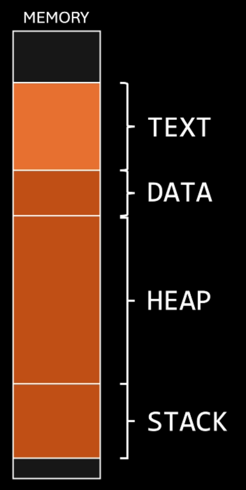

## What is Linux

TODO

## Disk & Data Storage

### Disk Partitions

Except for the `/boot` and `/root` partitions, all partitions are optional and flexible. You can add any partitions to your disk, however, these are the most common ones:

| Partition    | Needed                                 | File System      | Recommended Size      | Description                                                                                 |
| ------------ | -------------------------------------- | ---------------- | --------------------- | ------------------------------------------------------------------------------------------- |
| `/boot`      | Yes                                    | `ext2`           | 512 MB                | Store kernels and boot info. This should always be the first partition on the drive.        |
| `/boot/efi`  | Depends                                | `FAT-32`         | 512 MB                | Needed to boot with UEFI.                                                                   |
| `/BIOS Boot` | Depends                                | Not formatted    | 1 MB                  | Only applies to GPT, and is usually a 1 MB partition for GRUB to install the bootloader on. |
| `/root`      | Yes                                    | `ext4`           | 20+ GB                | Stores system files.                                                                        |
| `/swap`      | No                                     | `swap` (header)  | 2x RAM; at least 2 GB | Use the disk as 'slower RAM', if the system RAM is full.                                    |
| `/tmp`       | No (can be mounted on the `/root` dir) | `tmpfs` / `ext3` | 10 GB                 | Temporary file system.                                                                      |
| `/home`      | No (can be mounted on the `/root` dir) | `ext4`           | max                   | Stores user files.                                                                          |

#### Manage Partitions

One of the most common programs to manage partitions is `fdisk`.

```sh
sudo fdisk /dev/sdX
```

Then, type `m` to read the manual.

#### Format Partitions

Use the `mkfs` command to format existing partitions.

```sh
mkfs -v -t ext4 /dev/sdX
```

For initializing `swap`, use `mkswap /dev/sdX` instead.

#### Mount Partitions

A partition must be mounted for the host system to be able to access it.

```sh
mkdir -p <dir>
mount /dev/sdX <dir>
```

> Use the `-t <fs>` flag to specify the file system if `mount` fails to detect it automatically.

### File Systems

> This section is heavily simplified and only covers `EXT2-4`.

#### Concepts

- An `inode` provides the following information:
    - Pointer to the file
    - Creation date / Modified times
    - Permissions
- A `directory (table)` contains the data before the current directory, the directory itself, and every file inside that directory.
- A `block` is the standard data unit for data in a hard drive. (Same size as memory pages. Ex `x86` CPU would use `4 KB` as the block size.)
  

#### EXT2

Uses linked lists to store and lookup data, to keep the implementation of the filesystem itself as simple as possible. A simple filesystem makes it easier to repair (or skip) broken sectors on the hard drive.

#### Partition Layout


#### EXT3

##### Journal

`EXT3` implements a journal to act as a buffer after a crash. If any operation in the journal fails, because it was logged, the filesystem is able to recover and finish any pending operations quickly, and not lose data. `EXT2` had another issue, where if an opened directory were deleted, its `inode` wouldn't be deleted, leaving an orphaned, empty `inode` on the filesystem. If the program holding it was to be closed, the `inode` would be deleted, but in the event of a crash, the `inode` would be left in the filesystem, with no way to be freed.

##### HTrees

`EXT3` can also use a [index](notes/algorithms_and_data/index.md) instead of a linked list to store directory entries, making lookup times much faster. To build the HTree, all filenames are hashed and ordered, making the implementation more complex. This feature is disabled by default.

##### Scalability

Before, only one core could write to the *superblock* at a time, but `EXT3` updates `inode` and `block` count at the *block group descrip_t_or* level. The superblock is only updated through a system call: `statfs()`, or if the filesystem is unmounted.  
`EXT3` also removed *big kernel locks* (deprecated feature that added the ability to freeze the kernel), and `sleep_on()`, which was replaced with `wait_event()`, preventing infinite loops.  
These patches improved multicore performance by over 10x.

##### Preallocation / Reservation

Writing two files simultaneously can create noncontinuous space.  
  
Because `EXT3` was designed to be used with HDDs, and separate portions of a file would slow down read speeds, `EXT3` implemented a preallocation/reservation system.  
Inside the block bitmap, a few extra blocks were preallocated, storing both files in separate locations.  
  
Instead of `EXT2`, where errors were corrected directly in the hard drive, `EXT3` reserves space for each specific `inode` in memory. In the event of a crash, all data would be stored in memory, and thus, not corrupting the HDD itself.

##### Online Resizer

`EXT3` also implements a protocol to support `LVM`, which allows for many disks to be used as a single partition. The largest possible space `EXT3` supports without patches is 16 GB.

##### Partition Layout


#### EXT4

##### Larger FS

`EXT3` can only support up to 16 TB. This is why `EXT4` was created.  
Instead of ==32 bits== capacity to count blocks, `EXT4` divides each entry in the block descriptor table in two parts: An upper, and a lower entry. This lower entry extends the upper one, and since each supports up to ==32 bits==, the total supported block count (in the block descriptor table) rises to ==64 bits== (16 TB → 1,000,000,000 TB).

##### Extents

Instead of using block mapping (the filesystem allocates blocks individually for each file), which can lead to fragmentation, `EXT4` uses **extents**, a range of contiguous blocks, allocated to each file.  
This uses a 48 bit system, which limits the FS capacity to 1 EB (1,000,000 TB).  
Each extent can point to 128 MB of data, or 1 block group.

##### Compatibility

The `EXT4` driver supports `EXT3` as well, and so, the Linux kernel only uses the `EXT2` and `EXT4` drivers. The `EXT3` driver was removed as the new one is more performant.

##### HTrees

HTrees are now enabled by default, allowing up to 10 million subdirectories. However, `EXT4` implements a Three Level HTree, which can be enabled using the `large_dir` flag, and extends this limit to 2 Billion subdirectories.

##### Fast FS Check

The `big_itable_unused` field was added to the block descriptor table, allowing for fast filesystem checks and error correction, as well as some other improvements.

##### Multiblock Allocation

Previously, each block needed one call to be allocated. `EXT4` added support for multi-block allocation, which means that only one call is needed to allocate multiple blocks.

##### Delayed Allocation

Every write command is delayed for as long as possible, making it so that changes can be made in memory before they affect (and possible fragment) the actual drive.

##### Persistent PreAllocaition

The FS can now be called to preallocate an empty extent, so, once that file is populated, it stays as a contiguous space.

##### Metadata Checksums

Metadata is checked often, which helps find any issues with the file system, as each data structure is now properly 'documented'.

##### Better Times

- A creation time was added;
- The time precision was increased to nanoseconds instead of only seconds;
- The maximum supported time was increased as well (the standard UNIX time can only go up to 2038).

##### Extended Attributes

The filesystem can also be customized with new entries at the end of each `inode`.

##### Quotas

`EXT4` also supports adding limits to the size of a file, or even multiple files spread across the filesystem.

##### Barriers

Some hard drives have caches, which impact the journal, sometimes causing it to be written after the cache, which would create conflicts. To fix this issue, `EXT4` creates a 'barrier', preventing the disk from writing data before the journal is written to the drive. This feature impacts performance, but is also very needed.

##### Flexible Block Groups

Groups blocks together, isolating chucks to write data on, which helps make data more contiguous.

##### Meta Block Groups

If the whole filesystem was only a single block group, it would max out at 256 TB of total data. Using meta block groups, this limit is increased to 32 bits of block group descriptor, which makes the **total capacity of the filesystem** ==**512 PB**==.

##### Partition Layout

[https://maplecircuit.dev/linux/fs/ext/ext4.html](https://maplecircuit.dev/linux/fs/ext/ext4.html)

### File Permissions

TODO

```sh
chown root:root $LFS 
chmod 755 $LFS
```

### `/root` Directory Structure

Root directories might vary slightly between distributions (and other UNIX systems), however, the 'base' is always the same. For example, a Debian root directory would be the following:

```
/
├── bin   -> /usr/bin
├── boot (Mount point for /boot partition)
│   ├── grub/grub2    (GRUB configuration and modules)
│   ├── efi           (EFI System Partition - UEFI systems)
│   └── kernels       (Kernel images - may be under grub)
├── dev
│   ├── pts           (Pseudo-terminals)
│   ├── shm           (Shared memory)
│   ├── null          (Null device)
│   ├── zero          (Zero device)
│   ├── random        (Random number generator)
│   └── urandom       (Non-blocking random number generator)
├── etc (Configuration files)
│   ├── network       (Networking configuration)
│   ├── systemd       (Systemd configuration)
│   ├── default       (Default settings for programs)
│   ├── init.d        (Legacy init scripts / systemd link)
│   ├── ssh           (SSH server and client configuration)
│   ├── X11           (X Window System configuration)
│   ├── pam.d         (PAM configuration)
│   └── security      (Security-related configuration)
├── home (Home Directories)
├── lib   -> /usr/lib
├── lib64 -> /usr/lib64
├── media    (Mount Point for Removable Media)
├── mnt      (Temporary Mount Point)
├── opt      (Optional Packages)
├── proc     (Process Information - Virtual Filesystem)
│   ├── self          (Symbolic link to the current process's directory)
│   ├── cpuinfo       (CPU information)
│   ├── meminfo       (Memory information)
│   ├── mounts        (Mounted file systems)
│   ├── cmdline       (Kernel command line)
│   ├── <PID>         (Directories for each process, named by PID)
├── root (Root User's Home Directory)
├── run
│   ├── systemd       (Systemd runtime data)
│   ├── user          (User-specific runtime data)
│   └── lock          (Lock files)
├── sbin  -> /usr/sbin
├── srv (Service Data)
├── sys (System Information - Virtual Filesystem)
│   ├── devices       (Device tree)
│   ├── firmware      (Firmware information)
│   ├── power         (Power management settings)
│   ├── kernel        (Kernel parameters)
│   └── module        (Kernel modules)
├── tmp (Temporary Files)
├── usr (User Programs and Data)
│   ├── bin           (User binaries)
│   ├── sbin          (Non-essential system administration commands)
│   ├── lib           (Libraries for /usr/bin and /usr/sbin)
│   ├── include       (Header files for C/C++ development)
│   ├── share         (Architecture-independent data)
│   └── local         (Locally installed software)
└── var (Variable Data)
    ├── log           (System log files)
    ├── tmp           (Temporary files that persist across reboots)
    ├── lib           (Variable data for installed programs)
    ├── cache         (Cached data for applications)
    └── spool         (Spool directories)
```

## Kernel

Linux is a kernel: the core of an operative system. OSes that use the Linux kernel are called Linux Distros (Distributions).  
A Kernel does the following:
- Executes first when the computer boots up and has full access to the hardware.
- Implements drivers to control peripherals, network devices and other resources.
- Runs other programs (userland software) and allows them to communicate with each other and with the hardware.

### Compiling

First, install the necessary dependencies. For example, on Debian:

```sh
sudo apt install build-essential
sudo apt build-dep linux
```

#### Compile the Kernel from Scratch

```sh
git clone --depth 1 https://github.com/torvalds/linux # GitHub mirror
cd linux
make tinyconfig # OPTIONAL: Creates the most minimal configuration possible.
make nconfig # Configure the kernel before compiling
make -j$(nproc) # Compile the kernel 
```

The kernel binary compiles to `arch/x86/boot/bzImage` on `x64` systems.

#### Rebuild the Kernel for an Existing Installation

```sh
mkdir linux-parent && cd linux-parent
git clone --depth 1 https://github.com/torvalds/linux 
cd linux

cp /boot/config-$(uname -r) .config # Copy current kernel config
make nconfig # Edit the current kernel configuration
diff /boot/config-$(uname -r) .config # Check your changes

# Do not include debugging symbols. Alternatively, use `strip` to remove them. (these configs are working as of 6.14)
scripts/config --undefine GDB_SCRIPTS
scripts/config --undefine DEBUG_INFO
scripts/config --undefine DEBUG_INFO_SPLIT
scripts/config --undefine DEBUG_INFO_REDUCED
scripts/config --undefine DEBUG_INFO_COMPRESSED
scripts/config --set-val  DEBUG_INFO_NONE       y
scripts/config --set-val  DEBUG_INFO_DWARF5     n
scripts/config --disable DEBUG_INFO_DWARF_TOOLCHAIN_DEFAULT
```

##### Install Manually

```sh
make -j$(nproc)
sudo make modules_install
sudo make install # Copies the kernel image to /boot and updates initrd and grub.
```

Before rebooting, run `uname -mrs`, and note the version. On your next reboot, use the same command to verify that you are using the new kernel.

To remove the kernel after installing it manually, run the following commands:

```sh
sudo rm /boot/*-<version>*
sudo update-grub
```

##### Install Using `dpkg` (Debian)

```sh
make -j$(nproc) deb-pkg LOCALVERSION=-custom
sudo dpkg -i ../linux-headers*-custom*.deb
sudo dpkg -i ../linux-image*-custom*.deb
```

### Modules

A kernel module is a snippet of code that can be added to the kernel and managed without having to recompile the kernel.

For example, this `example.c` file would be a valid kernel module, that prints a message to the log once it is enabled or disabled:

```c
#include <linux/init.h>
#include <linux/kernel.h>
#include <linux/module.h>

MODULE_LICENSE("GPL");
MODULE_AUTHOR("Trude");
MODULE_DESCRIPTION("A simple kernel module to print a log message");
MODULE_VERSION("0.1");

static int __init kernel_message_init(void) {
 printk(KERN_INFO "Example module loaded!\n");
 return 0; //  Non-zero return means module couldn't be loaded.
}

static void __exit kernel_message_exit(void) {
 printk(KERN_INFO "Example module unloaded!\n");
}

module_init(kernel_message_init);
module_exit(kernel_message_exit);
```

To install the module, it first must be compiled.  
The following `Makefile` can compile, clean, and test the module:

```Makefile
obj-m := example.o

all:
	make -C /lib/modules/$(shell uname -r)/build M=$(PWD) modules
clean:
	make -C /lib/modules/$(shell uname -r)/build M=$(PWD) clean

test:
	sudo dmesg -C          # Clear the kernel log
	sudo insmod example.ko # Load the module
	sudo rmmod example.ko  # Unload the module
	sudo dmesg             # Read the kernel log
```

Then, to run the module:

```sh
make       # Compile the module
make test  # Load and unload the module
make clean # Delete the object files created at compile time
```


### Syscalls

To "ask" the kernel to perform a hardware task, to access the file system or access other resources, a program executes a `syscall`.  

For example, in x64 assembly:

```Assembly
// sys_write (Print to stdout)
mov rax, 1
mov rdi, 1
lea rsi, [hello_world]
// Buffer length
mov rdx, 14
syscall
```

This snippet implements a syscall that prints text to `stdout`, usually a terminal window.  
A C program generally uses libraries, which then implement system calls to perform actions.

### Processes

TODO - How does the kernel execute programs? What are processes?  
Executables can either be ELF files, or a script starting with `#!` (`script_format`).

#### Execute Programs

When executing a program, the kernel first parses the executable to detect whether it is a script or ELF executable, then, CPU registers are updated (the `instruction pointer` -> `ELF entry point`, etc). Finally, the program is executed, instruction by instruction, on the CPU.

### Devices

#### Device Drivers

Once a new device is plugged in, it attempts to call the Kernel, which identifies that device. The Kernel then loads the appropriate driver. Drivers are Kernel Modules used to interact with hardware. Once the required module is loaded, the Kernel calls the `udevadm` program, that creates a device file in the `/dev` directory.  
Whenever there is a read/write operation to that device, the Kernel intercepts the request and calls the driver function instead, which implements that operation, and this is why a driver must implement all possible file operations.  
Not all devices control hardware. For example, `/dev/random` generates a random number.  
In the Linux Kernel, there are **Character Type Devices** and **Block Type Devices.**  
A Character Device provides an endless stream or characters that can be read one at a time. This includes a keyboard and sensors, for example. Block Devices provide data as blocks of a defined size. These include disks and USB drives.  
The only exceptions are Network Devices. Network data cannot be manipulated with file operations, so they are handled differently in the kernel.

#### Network Devices

If a network card is plugged in, like any other device, it communicates with the Kernel, and the Kernel loads the appropriate Kernel Module that contains the driver. After that, the driver adds new entries to the Kernel's `NICs`, which are data structures stored in memory. The driver then creates configuration files in the `/sys/class/net/` directory. These are not device files, just configuration files. Different network cards can have multiple network interfaces, and even multiple ports to connect to an Ethernet cable, for example. Each interface gets its own folder, as they can have different configurations. Editing these files can change device configurations, but the only way to actually use these interfaces is by calling the Kernel directly. The Kernel can, in turn, create a virtual file in memory, which is then passed as an ID to the application. The application still receives it as a regular file ID (File Descriptor), like with any other device, but it works differently from the Kernel's perspective.  
A GPU works similarly, and although the Kernel exposes these devices as files, they are not real files in the filesystem, as doing so would slow them down immensely.

#### GPUs

At the startup time, a device file is generated for the GPU, like any other device.  
When an application attempts to use the GPU, it first searches for a **Graphics API** to use with it. Examples include Vulkan, OpenGL and DirectX.  
These APIs are code functions that forward the requests to a library such as `Mesa`.  
  
`Mesa` then calls the Kernel's DRM (Direct Rendering Engine), which then calls the GPU driver to provide GPU capabilities.  
The GPU still has a device file, which is used by the Kernel's DRM and Mesa, but most commands are delivered to the GPU driver directly.

## Shell ([bash](bash.md))

The kernel by itself isn't intractable, so a shell is needed for the user to be able to execute programs and run commands. Bash is not only a prompt, but also an interpreter for its own programming language, which can be used to write scripts and automate tasks.

### Compiling

TODO

## Programs

### `coreutils`

### `util-linux`

### `vi/nano`

## Libraries

### `glibc`

### `ncurses`

## Init System

## GRUB

## Networking

## Compilers

## Desktop

### Wayland

### Window Managers

### Desktop Environments

## INC =-------

## Processes

TODO  
A program is an executable containing machine code. When a computer executes a program, it is first loaded into memory.  
  
A program loaded in memory is a process.

> Note: For interpreted languages, the interpreter creates a process that executes code directly.
