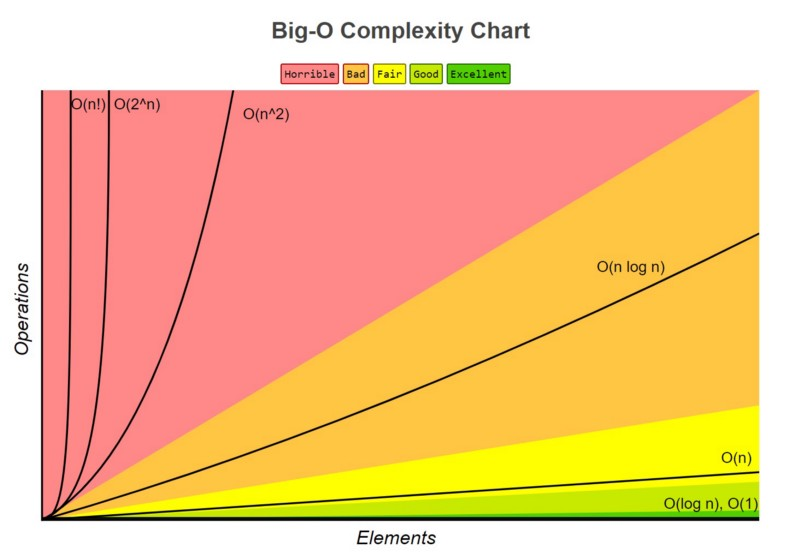
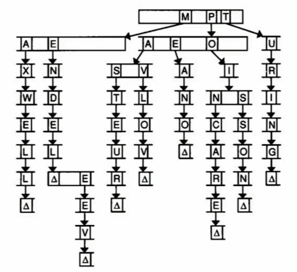

## Time Complexity

The amount of steps required for an algorithm to execute.

### Big O Notation

Maximum time for `n` input size. (Upper bound - worst case)  


### Omega Notation

Minimum time for `n` input size. (Lower bound)
- `Ω(n²)`
- `Ω(n log n)`
- `Ω(n)`
- `Ω(log n)`
- `Ω(1)`

> If both are the same, use `θ`

## Searching Algorithms

|Algorithm|Average Time Complexity|RAM|
|---|---|---|
|Linear Search|O(n) \| Ω(1)|0|
|Binary Search|O(log n) \| Ω(1)|0|

### Linear Search

Check every element until `n` is found.

```C
#include <stdio.h>
int main(void) {
	int n = 1; // number to find
	int numbers[] = {20, 500, 10, 5, 100, 1, 50};
	const int numbersLength = 7;
	for (int i = 0; i < numbersLength; i++) {
		if (numbers[i] == n) {
			printf("Found n\n");
			return 0;
		}
	}
	printf("Not found\n");
	return 1;
}
```

### Binary Search

```C
#include <stdio.h>
int main()
{
  int c;
	int n = 10 // Number of elements in array
	int array[] = {0, 1, 2, 3, 4, 5, 6, 7, 8 ,9}
	int search = 2; // Number to find
  int first = 0;
  int last = n - 1;
  int middle = (first+last)/2; // Average
  while (first <= last) {
    if (array[middle] < search)
      first = middle + 1;
    else if (array[middle] == search) {
      printf("%d found at location %d.\n", search, middle+1);
      break;
    }
    else
      last = middle - 1;
    middle = (first + last)/2;
  }
  if (first > last)
    printf("Not found! %d isn't present in the list.\n", search);
  return 0;
}
```

## Sorting Algorithms

|Algorithm|Average Time Complexity|RAM|Use If|
|---|---|---|---|
|Selection Sort|O(n²) \| Ω(n²)|1 var|Never|
|Bubble Sort|O(n²) \| Ω(n)|0||
|Insertion Sort|O(n²) (Faster if the data is kind of sorted)|0||
|Merge Sort|O(n log n) \| Ω(n log n)|More RAM|Large Arrays|
|Quick Sort|O(n log n)|Less RAM|Small arrays|

## Data Structures

### Queue (Concept)

First In, First Out
- enqueue - Add an item to the end of the line.
- dequeue - Remove an item from the beginning of the line.

### Stack (Concept)

Last In, First Out  
The last item added will be used first, so the first ones added might never be used.
- push - Add an item to the top of the stack
- pop - Remove an item from the top of the stack

### Arrays

|Search|O(log n)|
|---|---|
|Multiple data types|No|
|Resizable|No|
|RAM Usage|Low|

```C
double prices[] = {5.0, 3.2, 13.0};
double values[5]; //Initialize an empty array, that can hold 5 items.
printf("%lf€", prices[0]);
printf("%d", sizeof(prices)); //3
```

#### 2D Arrays

```C
int numbers[2][3] = {
	{1, 2, 3},
	{4, 5, 6}
};
numbers[0][1]; //2
numbers[1][2]; //6
numbers[0][1] = 10; //Set [0][1] to 10.
// Note: Calculate the rows and columns automatically.
int rows = sizeof(numbers)/sizeof(numbers[0]);
int columns = sizeof(numbers[0])/sizeof(numbers[0][0]);
```

#### Array of Strings

```C
char cars[][10] = {"Mustang", "Corvette", "Camaro"};
//cars[0] = "Tesla"; ERROR! String arrays don't support item assignment.
strcpy(cars[0], "Tesla"); //Does the same, but <string.h> must be included.
```

### Resize Array

#### Manually

```C
#include <stdlib.h>
int *list = malloc(3 * sizeof(int));
// Works like an array
list[0] = 1;
list[1] = 2;
list[2] = 3;
//Same as
*list = 1;
*(list + 1) = 2;
*(list + 2) = 3;
// ...
// Add 1 extra byte to the array
int *tmp = malloc(4 * sizeof(int));
if (tmp == NULL) {
	free(list);
	return 1;
}
for (int i = 0; i < 3; i++){
	tmp[i] = list[i];
}
tmp[3] = 4;
free(list);
list = tmp;
// ...
free(list);
return 0;
```

#### Realloc

```C
int *list = malloc(3 * sizeof(int));
list[0] = 1;
list[1] = 2;
list[2] = 3;
// ...
int *tmp = realloc(list, 4 * sizeof(int)); //tmp is only needed to verify if realloc was successful, if realloc was assigned to int and failed, the 3 bytes from the list would be lost as list = NULL.
if (tmp == NULL) {
	free(list);
	return 1;
}
list = tmp;
list[3] = 4;
// ...
free(list);
return 0;
```

### Linked Lists

| Linked List           | TC     |
| --------------------- | ------ |
| Add element unordered | O(1)   |
| Add element ordered   | O(n)   |
| Search                | O(n)   |
| Insert                | O(n)   |
| Multiple data types   | Yes    |
| Resizable             | Yes    |
| RAM Usage             | Medium |

Each element has its value, and a pointer to the next element. The last element's pointer is `NULL`. (NULL == 0x0)

```Plain
[N] -> [N] -> [N] -> [N] ...
```

```C
typedef struct node {
	int number;        // Value
	struct node *next; // Pointer to the next node
} node;
```

#### Unordered Linked List Example

Both code blocks are unsafe (if there's no memory, the program won't free)

```C
typedef struct node {
	int number;
	struct node *next;
} node;
int main(void) {
	node *list = NULL;
	node *n = malloc(sizeof(node)); // n points at the first node of the linked list.
	(*n).number = 1; // First element = 1.
	//Or
	n->number = 1;   // Same.
	n->next = NULL;  // Point to NULL so it won't point to a garbage value.
	list = n;
	node *n = malloc(sizeof(node)); // n points at the first node of the linked list.
	n->number = 2;
	n->next = list;
	list = n;
}
```

```C
#include <stdlib.h>
#include <stdio.h>
typedef struct node {
	int number;
	struct node *next;
} node;
int main(void) {
	node *list = NULL;
	int numbers[] = {1, 2, 3};
	// Create linked list with the elements in the array.
	for (int i = 0; i < 3; i++) {
			node *n = malloc(sizeof(node));
			if (n == NULL) return 1;
			n->number = number;
			n->next = NULL;
			n->next = list;
			list = n;
		}
	// Print all elements from linked list.
	node *ptr = list;
	while (ptr != NULL) {
		printf("%i\\n", ptr->number);
		ptr = ptr->next; // Borrow the value in the list->n, which has the next node address.
	}
	// Free the list's memory.
	ptr = list;
	while (ptr != NULL) {
		node *next = ptr->next;
		free(ptr);
		ptr = next;
	}
}
```

### Trees

| Balanced            | Unbalanced | TC   |
| ------------------- | ---------- | ---- |
| Add element         | O(n)       | O(n) |
| Search              | O(log n)   | O(n) |
| Insert              | O(log n)   | O(n) |
| Multiple data types | Yes        | Yes  |
| Resizable           | Yes        | Yes  |
| RAM Usage           | High       | High |

If organized correctly, allows for binary search.  
Each node has 2 pointers.

```Plain
       [N]    - root / parent
     /     \\
   [N]     [N]  - parent and children
   / \\     / \\
 [N] [N] [N] [N] - leaf / child
```

```C
typedef struct treenode {
	int value;
	struct treenode *left;
  struct treenode *right;
} treenode;
treenode *createnode(int value) {
	treenode* result = malloc(sizeof(treenode));
	if (result != NULL) {
		result->left = NULL;
		result->right = NULL;
		result->value = value;
	}
	return result;
}
void printtabs(int numtabs){
	for (int i=0; i < numtabs; i++){
		printf("\\t");
	}
}
void printtree_rec(treenode *root, int level){
	if (root == NULL) {
		printtabs(level);
		printf("----<empty>-----\\n");
		return;
	}
	// Preordered
	printtabs(level);
	printf("value = %d\\n", root->value);
	printtabs(level);
	printf("left\\n");
	printtree_rec(root->left, level + 1);
	printtabs(level);
	printf("right\\n");
	printtree_rec(root->right, level + 1);
	printtabs(level);
	printf("done\\n");
}
void printtree(treenode *root) {
	printtree_rec(root, 0);
}
int main(void){
	treenode *n1 = createnode(10);
	treenode *n2 = createnode(11);
	treenode *n3 = createnode(12);
	treenode *n4 = createnode(13);
	treenode *n5 = createnode(14);
	// n1 will be the root
	n1->left = n2;
	n1->right = n3;
	n3->left = n4;
	n4->right = n5;
	printtree(n1);
	free(n1);
	free(n2);
	free(n3);
	free(n4);
	free(n5);
}
```

### Hash Tables

| Average             | Worst     | Best      |
| ------------------- | --------- | --------- |
| Add element         | O(1)      | O(n)      |
| Search              | O(1)      | O(n)      |
| Insert              | O(1)      | O(n)      |
| Multiple data types | Yes       | Yes       |
| Resizable           | Yes       | Yes       |
| RAM Usage           | Very High | Very High |

An array, in which every element is a linked list.  
The array is used to 'choose' a linked list, and the linked list stores a dynamic number of elements.

```C
[0] -> [N] -> [N] -> [N]
[1] -> [N] -> [N]
[2] -> [N]
[3] -> [N] -> [N]
[4] -> [N] -> [N] -> [N]
[5] -> [N] -> [N]
0-5 - Array element
N - Linked list node
```

### Trie

| Trie                | Average        | Worst          |
| ------------------- | -------------- | -------------- |
| Add element         | O(1)           | O(1)           |
| Search              | O(1)           | O(1)           |
| Insert              | O(1)           | O(1)           |
| Multiple data types | Yes            | Yes            |
| Resizable           | Yes            | Yes            |
| RAM Usage           | Extremely High | Extremely High |

Tree, but every node is an array.  
Useful to store words. Every element in an array is linked to the next letter.  


```C
#include <stdio.h>
#include <stdlib.h>
#include <stdbool.h>
#include <string.h>
#define ALPHABET_SIZE 26
struct TrieNode {
    struct TrieNode *children[ALPHABET_SIZE];
    bool isendofword;
};
typedef struct TrieNode TrieNode;
TrieNode *createNode() {
    TrieNode *node = (TrieNode *)malloc(sizeof(TrieNode));
    node->isendofword = false;
    for (int i = 0; i < ALPHABET_SIZE; i++) {
        node->children[i] = NULL;
    }
    return node;
}
void insert(TrieNode *root, const char *key) {
    TrieNode *current = root;
    for (int i = 0; i < strlen(key); i++) {
        int index = key[i] - 'a';
        if (current->children[index] == NULL) {
            current->children[index] = createNode();
        }
        current = current->children[index];
    }
    current->isendofword = true;
}
bool search(TrieNode *root, const char *key) {
    TrieNode *current = root;
    for (int i = 0; i < strlen(key); i++) {
        int index = key[i] - 'a';
        if (current->children[index] == NULL) {
            return false;
        }
        current = current->children[index];
    }
    return (current != NULL && current->isendofword);
}
bool isempty(TrieNode *root) {
    for (int i = 0; i < ALPHABET_SIZE; i++) {
        if (root->children[i] != NULL) {
            return false;
        }
    }
    return true;
}
TrieNode *deleteHelper(TrieNode *root, const char *key, int depth) {
    if (root == NULL) {
        return NULL;
    }
    if (depth == strlen(key)) {
        if (root->isendofword) {
            root->isendofword = false;
        }
        if (isempty(root)) {
            free(root);
            root = NULL;
        }
        return root;
    }
    int index = key[depth] - 'a';
    root->children[index] = deleteHelper(root->children[index], key, depth + 1);
    if (isempty(root) && !root->isendofword) {
        free(root);
        root = NULL;
    }
    return root;
}
void deletekey(TrieNode *root, const char *key) {
    deleteHelper(root, key, 0);
}
int main() {
    TrieNode *root = createNode();
    insert(root, "example");
    insert(root, "word");
    printf("%s\n", search(root, "word") ? "Found" : "Not Found");
    printf("%s\n", search(root, "example") ? "Found" : "Not Found");
    printf("%s\n", search(root, "trude") ? "Found" : "Not Found");
    deletekey(root, "word");
    printf("%s\n", search(root, "word") ? "Found" : "Not Found");
    return 0;
}
```
