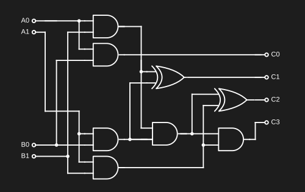

## Diodes

A diode allows current to only flow in one direction in a circuit.

### Schematic

```Plain
Anode (+) --|>|-- Cathode (-)
```

### Examples

```Plain
[Conventional Current (+) -> (-)]
(+)------|>|------(-)   Current can flow - The diode is now a conductor.
(+)------|<|------(-)   Current can't flow - The diode is now an insulator.
```

### Use Cases

- Protect a circuit (if a battery is connected incorrectly, for example)
- Convert AC to DC current  
Fun fact: An LED, for example, is a Light-Emitting Diode.

### How a Diode Works

#### Conductors and Insulators

An atom contains the following elements:
- Nucleus (Protons - Neutrons)
- Orbital Shells (Holds the electrons, which orbit around the nucleus)
- Conduction band  
The electrons closest to the nucleus hold the most energy.  
The outermost shell is the valence shell. A conductor has 1-3 electrons in the valence shell.  
If an electron reaches the conduction band, it can break free and move to another atom.  
An insulator, however, has a conduction band that is far from the valence shell, making it difficult for an electron to escape.  
For example, for copper (a great conductor), the valence shell and conduction band overlap, so it's very easy for an electron to jump between atoms.  
Semiconductors have a conduction band close to the valence shell, but have one extra electron in it, making it an insulator. However, given some external energy, some electrons will gain enough energy to reach the conduction band and become free.

#### P-Type and N-Type Doping

Silicon is a good semiconductor, having 4 electrons in its valence shell. When close to other `Si` atoms, they share 4 electrons with their neighbors, thus, having 8, each, and becoming stable.

```Plain
Silicon:
Si Si Si Si Si Si Si Si Si Si Si
Si Si Si Si Si Si Si Si Si Si Si
Si Si Si Si Si Si Si Si Si Si Si
Si Si Si Si Si Si Si Si Si Si Si
Si Si Si Si Si Si Si Si Si Si Si
Si Si Si Si Si Si Si Si Si Si Si
```

##### N-Type

Some Phosphorus is added to the Silicon. ==`p`== has one extra electron in its valence shell.  
These electrons are not needed, and so, they flow freely from atom to atom.  

```Plain
Si Si p Si Si Si Si Si Si Si p
p Si Si Si Si p Si Si Si Si Si
Si Si Si p Si Si Si Si p Si Si
Si p Si Si p Si Si Si Si Si Si
Si Si Si Si Si Si p Si Si p Si
Si p Si Si Si Si Si Si p Si Si
```

##### P-Type

Some Aluminum is added to the Silicon. `Al` is missing one electron, so it can't provide its 4 neighbors with an electron to share.

```Plain
Si Si Al Si Si Si Si Si Si Si Al
Al Si Si Si Si Al Si Si Si Si Si
Si Si Si Al Si Si Si Si Al Si Si
Si Al Si Si Al Si Si Si Si Si Si
Si Si Si Si Si Si Al Si Si Al Si
Si Al Si Si Si Si Si Si Al Si Si
```

#### Combining both Types

When an N-Type is combined with a P-Type, some electrons from the N-Type side will move over to the P-Type side and occupy the missing electrons there. This creates a barrier between both types, creating an electric field that prevents more electrons from switching sides.

##### Forward Bias

If energy is provided to the Cathode, the electrons flow, as the voltage is superior to the barrier's.

```Plain
(-)-----[P|N]-----(+)
```

##### Reverse Bias

If energy is provided to the Anode, the electrons can't flow, as the barrier expands.

```Plain
(-)--[P]      [N]--(+)
```

## Transistor

Transistors are electronic components that behave like a `switch`, or `amplifier`.

### Schematic

```Plain
        .--.,-- Collector
Base --(--|<)
        `--`'-- Emitter
```

### Examples

#### Switch

If the `base` pin is provided with energy, the transistor allows current to flow in the main circuit.  
![[image.png]]

#### Amplifier

Altering the voltage given to the `base` pin allows us to control a larger voltage in the main circuit.  


### Types of Transistor

#### NPN

An NPN transistor combines the `base` pin and `collector` pin.  


> Note: Even if the collector pin is disconnected from the circuit, a small amount of current still passes through. 

#### PNP

A PNP transistor receives energy through the `emitter` pin, and then divides it to the remaining pins.  


## Basic Logic

A logic gate is a device that performs one boolean operation: Two binary inputs produce a single binary output. These building blocks are the foundations of modern computing.  
Each gate has its own truth table, which defines every possible input and output variations.

### NAND

A NAND gate can be used to build all other basic gates. It always outputs, unless both inputs are active.


#### Truth Table

|A|**B**|**Output**|
|---|---|---|
|0|0|1|
|0|1|1|
|1|0|1|
|1|1|0|

#### Implementation

##### Electronics

Implementation using switches (transistors could be used instead) and a pull-up resistor:  
![[NAND_circuit.png]]

### NOT

Invert any given input.  


#### Truth Table

|**Input**|**Output**|
|---|---|
|0|1|
|1|0|

#### Implementation

##### Logic Gates

![[NOT_gates.png]]

##### Electronics


### AND

Outputs `1` only when both inputs are `1`.


#### Truth Table

|A|**B**|**Output**|
|---|---|---|
|0|0|0|
|0|1|0|
|1|0|0|
|1|1|1|

#### Implementation

##### Logic Gates

![[AND_gates.png]]

##### Electronics

  


#### Bigger AND Gate

AND gates can be chained to accept more inputs.  

![[AND_gates_big.png]]

##### Truth Table

| A   | **B** | C   | **Output** |
| --- | ----- | --- | ---------- |
| 0   | 0     | 0   | 0          |
| 0   | 1     | 0   | 0          |
| 1   | 0     | 0   | 0          |
| 1   | 1     | 0   | 0          |
| 0   | 0     | 1   | 0          |
| 0   | 1     | 1   | 0          |
| 1   | 0     | 1   | 0          |
| 1   | 1     | 1   | 1          |

### OR

Outputs `1` if at least one input is `1`.  


#### Truth Table

|A|**B**|**Output**|
|---|---|---|
|0|0|0|
|0|1|1|
|1|0|1|
|1|1|1|

#### Implementation

##### Logic Gates

![[OR_gates.png]]

##### Electronics


#### Bigger OR Gate

![[OR_gates_big.png]]

##### Truth Table

| A   | **B** | C   | **Output** |
| --- | ----- | --- | ---------- |
| 0   | 0     | 0   | 0          |
| 0   | 1     | 0   | 1          |
| 1   | 0     | 0   | 1          |
| 1   | 1     | 0   | 1          |
| 0   | 0     | 1   | 1          |
| 0   | 1     | 1   | 1          |
| 1   | 0     | 1   | 1          |
| 1   | 1     | 1   | 1          |

### NOR

An OR gate followed by a NOT gate.  

A NOR gate is can also be used to build every other gate, just like NAND. However, NAND gates are preferred over NOR gates, as, in modern computers, they occupy less area and have less delay.


#### Truth Table

|A|**B**|**Output**|
|---|---|---|
|0|0|1|
|0|1|0|
|1|0|0|
|1|1|0|

#### Implementation

##### Logic Gates

![[NOR_gates.png]]

### XOR

Either input is `1`, exclusively. (OR, but if both inputs are on, it turns off.)

  

#### Truth Table

| A   | **B** | **Output** |
| --- | ----- | ---------- |
| 0   | 0     | 0          |
| 0   | 1     | 1          |
| 1   | 0     | 1          |
| 1   | 1     | 0          |

#### Implementation

##### Logic Gates

![[XOR_gates.png]]

### XNOR

Inverted `XOR`.  


#### Truth Table

|A|**B**|**Output**|
|---|---|---|
|0|0|1|
|0|1|0|
|1|0|0|
|1|1|1|

#### Implementation

##### Logic Gates

![[XNOR_gates.png]]  

Although this circuits works, it can be further optimized to save `1` gate.  

![[Pasted image 20250306105245.png]]

> From this point on, circuits will become exponentially more complex. Optimizations like this one can be found almost everywhere, however, when the choice between efficiency and readability arises, I will choose to keep things simple. If you found a way to optimize any of my circuits, please let me know. I'd be happy to keep improving these notes, and credit you for your findings.

## Binary

Binary is a base-2 numeral system: A simple way to represent numbers using only two states. Each binary 'digit' is called a *bit*, and 8 bits together form a *byte*.  
To represent large binary values, it's common to use hexadecimal as well, to shorten them into a more readable format.

| Binary | Decimal | Hexadecimal |
| ------ | ------- | ----------- |
| 0000   | 00      | 0           |
| 0001   | 01      | 1           |
| 0010   | 02      | 2           |
| 0011   | 03      | 3           |
| 0100   | 04      | 4           |
| 0101   | 05      | 5           |
| 0110   | 06      | 6           |
| 0111   | 07      | 7           |
| 1000   | 08      | 8           |
| 1001   | 09      | 9           |
| 1010   | 10      | A           |
| 1011   | 11      | B           |
| 1100   | 12      | C           |
| 1101   | 13      | D           |
| 1110   | 14      | E           |
| 1111   | 15      | F           |


## Arithmetic Operations

### Addition

Adding two numbers can be done using a simple, manual algorithm: By adding the last *bit* of both numbers first, carry if necessary, then move to the next number, and so on.

| **+** | 0 | 1  |
| ------- | --- | ---- |
| 0     | 0 | 1  |
| 1     | 1 | 10 |


#### Half Adder

Add 2, single-digit binary numbers.

| **A** | **B** | **Carry** | **Sum** |
| ----- | ----- | --------- | ------- |
| 0     | 0     | 0         | 0       |
| 0     | 1     | 0         | 1       |
| 1     | 0     | 0         | 1       |
| 1     | 1     | 1         | 0       |

![[half_adder.png]]

#### Full Adder (ADD)

When adding 2 binary numbers, one operation might return a carry value, which the `half adder` can't accept, as it only has 2 inputs.


To solve this issue, a `full adder` accepts 3 inputs.

![[full_adder.png]]

#### 8-Bit Adder

To add two bytes, chain 8 full-adders.  
(The dark blue lines are equivalent to 8 bits in parallel, simplified for better readability. The blue rectangles split the wire into 8 bits, or vice versa.)

![[full_adder_8bit.png]]

### Two's Complement

The most common solution to represent negative numbers is to interpret the last bit as a negative value. For a byte, the last bit changes its value from 128 to -128. 

> A negative number is often called a *signed* number.

The main advantage of the Two's Complement system is that the adder built previously also works with it.

#### Invert Sign

To switch between negative and positive numbers, flip all bits, then add 1.  

![[signed_negator.png]]

### Subtraction

Subtraction is as easy as negating (inverting the sign of) the second input.

![[Pasted image 20250306113013.png]]

### Multiplication

Multiplication is also similar to its decimal counterpart, but because binary is so small compared to decimal, the steps are also much simpler.

First, multiply the top number to every digit of the bottom one, and then add the results together.

| X   | 0   | 1   |
| --- | --- | --- |
| 0   | 0   | 0   |
| 1   | 0   | 1   |


#### 2-Bit By 2-Bit Multiplier



#### 4-Bit By 4-Bit Multiplier

![[Pasted image 20250306113821.png]]

### Division

Division is more complex. So much so, that it is often implemented in code, instead of hardware. For example, *ARM* CPUs don't have an instruction for division.  
Harder doesn't mean impossible of course, and if you are curious, there are many resources you can see. For example: [This Reddit post](https://www.reddit.com/r/TuringComplete/comments/1eqo00i/my_multiplier_and_divider_in_turing_complete/); [YouTube Video](https://www.youtube.com/watch?v=Wf_1mf6yCoc).

The steps for binary division are as follows:

1. Find the smallest part of the dividend greater than or equal to the **divisor**.

  
2. Write the first digit of **the answer**, and **copy the original divisor down**.

  
3. Subtract the **aligned dividend digits** by **the digits under the dividend**.

4. Lower **the next dividend digit**.  
   

5. Is **the total** greater or equal to the **divisor**? If so, add a `1` to the answer. If not, **add a `0` to the answer and return to step 4**.  
   


6. Return to step 2, until you reach the end of the number. If you reached the end, you found **the answer**.  
   

## Memory

### Byte Switch (SWC)

A bit switch, also known as a transistor, toggles a given input, using a second bit.

![[bit_switch.png]]

If 8 transistors are controlled by the same bit in parallel, a Byte Switch is created.

### Input Selector

Using byte switches, we can select which input to use.

![[input_selector.png]]

### Bus

A Bus is useful to simplify wiring. One bit controls which input should be selected, and a second one, the output. This way, a single wire can transfer twice as much information.

![[bus.png]]

### 1 Bit of Memory

There are [many ways](https://www.geeksforgeeks.org/latches-in-digital-logic/#sr-latch) to achieve a bit of memory.

#### Using Transistors and a Tick Delay

The oval component is a delay. This replaces the concept of a clock, however, in an electronic circuit, the save and load states are attached to a clock instead.

![[transistor_latch.png]]

#### SR Latch

A Set-Reset Latch is the simplest one. The `S` input sets the output to `1`, and the `R` input, to `0`. If both inputs are on, the latch is in an undefined state, and outputs `0`.

![[Pasted image 20250306120537.png]]

#### D Latch

A Data Latch has two inputs: `D` (Data) and `E` (Enable). When the `E` input is high, the output `Q` follows the input `D`. When the `E` input is low, the output `Q` holds the last value of `D`.

![[image.png]]

### 8bit Register

After obtaining one bit of memory (the hexagon component), a byte of memory can be built.

![[8bit_register.png]]

### Binary Decoder

A decoder splits the two states of a bit into two separate outputs.

![[decoder.png]]

### 3bit Decoder

![[3bit_decoder.png]]

### Counter

A counter adds 1 every tick (clock cycle) to its output. If needed, it can also be overwritten to any given value.

![[Pasted image 20250307115740.png]]

### RAM

We could add more registers to store as much data as needed, however, these don't scale well, as storing a lot of data would require millions of wires. To solve this issue, we can organize latches in a matrix instead of a long, horizontal line.  

  
To access a specific latch, binary decoders can be used.  
  
This way, a single, short memory address can select any latch in the matrix.

#### Reading and Writing to the Matrix

We can modify the latch to reduce the amount of wires needed.  
  
This new latch uses the same wire for both input and output.  
  
This circuit would store the same value on every latch, which isn't useful. With some modifications, however, we can use the memory address to select which latch to modify.  
  


#### Storing Bytes Instead of Bits

  
In this example, we can provide 1 byte of information, a `write` or `read` signal, and a memory address. Since we are storing a full byte, the same memory address applies for all 8, single bit circuits.  
To make it easier to understand, we can abstract these concepts further:  
![[Pasted image 20250307134315.png]]
  
The larger the Address Bus is, the more bits can be managed. This is why a 32bit CPU can't manage more than 4 GB of RAM.  

  

This kind of RAM is Static RAM (**S**RAM), which uses many transistors, making it faster, but is more expensive to produce than **D**RAM.

## CPU Architecture

### ALU

An ALU (Arithmetic Logic Unit) performs bitwise operations (OR, AND, NOR, NAND) and basic math (ADD, SUB). You can also add any other arithmetic functionality to it, such as multiplication and division.

This circuit uses the following instructions:
- `0` OR
- `1` NAND
- `2` NOR
- `3` AND
- `4` ADD
- `5` SUB

![[Pasted image 20250307131641.png]]

This ALU can also be optimized to use fewer gates:

![[Pasted image 20250307131757.png]]

### Conditions

Conditions allow the CPU to compare values. In this case, values are compared against 0.

Instructions:
- `0` Never (Always output 0)
- `1` If value = 0
- `2` If value < 0
- `3` If value ≤ 0
- `4` Always (Always output 1)
- `5` If value ≠ 0
- `6` If value ≥ 0
- `7` If value > 0

![[Pasted image 20250307135207.png]]

### Instruction Decoder

A binary decoder, adapted to use the last 2 bits of a byte.

Instructions:
- `0` Immediate
- `64` Calculation
- `128` Copy 
- `192` Condition

![[Pasted image 20250307140353.png]]

## Putting it All Together

### Upgraded Register

Adding an output pin to always output the register's value will prove to be useful in the future.

![[Pasted image 20250307164854.png]]

### Registers

TODO

![[Pasted image 20250307165834.png]]

---

### Assembly

Assembly is a human-friendly representation of code: binary values that a computer can understand.

  

An assembler converts ASM instructions into machine code, which is given to the CPU as input.

For example, a simple computer architecture could use `00` to represent arithmetic operations.  

  

These instructions are then read by the ALU we built previously, and this is how the computer 'knows' which operation to perform.

Of course, assembly can also provide instructions to store or load values from memory.


#### Select Which Instruction to Execute (first 2 bits)

A binary decoder is the perfect component to decide which instruction to execute.

  

For memory operations, the 3rd and 4th bits are used to select which register to use.  

  

The last 4 bits represent the memory address to read/write to.  


### Instruction Register

For the instruction to be given, it is stored in a special register: An Instruction Register.  


### Optimization

We can use a single Binary Decoder instead of two, to achieve the same result. (Optimization on the right pane)  
  
Different architectures can have the exact same functionality, while being implemented differently, or even having different instructions. This is why code that is compiled for Intel x64 is not compatible with ARM or RISC-V.

## Control Unit

We can finally add the ALU (Arithmetic Logic Unit) we built before into the new circuit, like so:  
  
The gray trapezoids are multiplexers:  
  
The output value is then stored in a temporary register, before replacing the first operand register's value.  
The component we just built to control the `ALU` is part of a `Control Unit`. The full `control unit` is very complex, as it needs to handle every possible instruction. (So far, we have seen how to implement the `ALU` and `RAM`.)  
  
Each register in the `CU` has a specific purpose, unlike `RAM`, which can be used to store any values.  
  
To read the first instruction, the `CU` will **fetch** data from the first address in memory.  
  
After **fetching**, the `CU` will **decode** the instruction: interpret the bit sequence in the `instruction register`, to send the necessary signals to the components that will **execute** the instruction. We can finally load instructions into the instruction register.  
  
Then, the `CU` increments 1 byte, to point the `address register` to the next instruction. (Modern architectures increment different values, as the instruction set is more complex)  
If the instruction is an arithmetic operation, the steps are similar. The ALU stores the output in a temporary register, which overwrites the register 0 with the result. The result can then be stored in `RAM`.  


## Load a Program Into Memory

So far, we can store instructions in memory, but it is also necessary to store values, besides from the instructions themselves.  
For example:  
  
This program uses 2 numeric values. The first 2 instructions load these values into the registers, and then, these values are added together and stored in another memory address. The final instruction, `HALT`, marks the end of the program, to make sure the `CU` does not attempt to read the number 20 as an instruction.  
If the program is extended, all memory addresses must be altered. To fix this issue, we can instead store values at the end of the memory stack.  


## Conditions and Loops

To create a loop, we can simply jump to a smaller address in memory.  
  
Internally, the `JMP` command overwrites the Address Register, making it so that the next CPU **cycle** *fetches* the chosen memory address, instead of the next one.  


### Flags

Sometimes, we might want to loop only if a certain condition is met.  
For context, imagine subtracting a number from itself. In this case, the ALU will provide some extra information, using 1 bit registers called `flags`.  
  

| N   | Flag         | Description                                               |
| --- | ------------ | --------------------------------------------------------- |
| 0   | **O**verflow | When a number is too large to fit in the output register. |
| 1   | **Z**ero     | When the result is zero.                                  |
| 0   | **N**egative | When a number is negative.                                |

This additional information can be used to make decisions, and make **conditional jumps** possible.  

| ASM            | Command       | Description                                                                                                                                                                               |
| -------------- | ------------- | ----------------------------------------------------------------------------------------------------------------------------------------------------------------------------------------- |
| `JMP_OFW XXXX` | Jump Overflow | Overwrites the `Address Register` with the value `XXXX` if the `O_FLAG` is **ON**. If the flag is **OFF**, the `Address Register`'s value is incremented by **1**.                        |
| `JMP_ZRO XXXX` | Jump Zero     | Overwrites the `Address Register` with the value `XXXX` if the `Z_FLAG` is **ON**. If the flag is **OFF**, the `Address Register`'s value is incremented by **1**.                        |
| `JMP_NEG XXXX` | Jump Negative | Overwrites the `Address Register` with the value `XXXX` if the `N_FLAG` is **ON**. If the flag is **OFF**, the `Address Register`'s value is incremented by **1**.                        |
| `JMP_ABV XXXX` | Jump Above    | Overwrites the `Address Register` with the value `XXXX` if **neither** the `Z_FLAG` nor `N_FLAG` are **ON**. If either is **ON,** the `Address Register`'s value is incremented by **1**. |

Comparing two numbers is the same as subtracting them.  

$$a - 5 = b$$

| **b** is negative | **b** is zero | **b** is positive |
| ----------------- | ------------- | ----------------- |
| then              | then          | then              |
| a < 5             | a == 5        | a > 5             |

For example:  
  
An `IF` statement works in the exact same way, but without the need to loop:  
  
Note: These instructions are not from any real architecture. These are examples for this simple, custom architecture.

## Clock

The final piece of the puzzle is the clock. A clock can give us time before a circuit loops.  
  
This is necessary, because energy travels extremely quickly, and so, all memory would be reset before we could even use the stored values. Each clock tick corresponds to an action the `CU` performs (fetch, decode and execute).  
A `Data FLIP-FLOP`, for example, uses the clock to store data, acting as the manual `RESET` input.  
  
This circuit can be used to build a single bit register.  
  
To generate a clock pulse, we can use a circuit similar to this one:  


## ASCII

Binary can also be used to represent characters.

| Dec | Hex | Binary   | HTML     | Char        | Description               |
| --- | --- | -------- | -------- | ----------- | ------------------------- |
| 0   | 00  | 00000000 | `&#0;`   | NUL         | Null                      |
| 1   | 01  | 00000001 | `&#1;`   | SOH         | Start of Heading          |
| 2   | 02  | 00000010 | `&#2;`   | STX         | Start of Text             |
| 3   | 03  | 00000011 | `&#3;`   | ETX         | End of Text               |
| 4   | 04  | 00000100 | `&#4;`   | EOT         | End of Transmission       |
| 5   | 05  | 00000101 | `&#5;`   | ENQ         | Enquiry                   |
| 6   | 06  | 00000110 | `&#6;`   | ACK         | Acknowledge               |
| 7   | 07  | 00000111 | `&#7;`   | BEL         | Bell                      |
| 8   | 08  | 00001000 | `&#8;`   | BS          | Backspace                 |
| 9   | 09  | 00001001 | `&#9;`   | HT          | Horizontal Tab            |
| 10  | 0A  | 00001010 | `&#10;`  | LF          | Line Feed                 |
| 11  | 0B  | 00001011 | `&#11;`  | VT          | Vertical Tab              |
| 12  | 0C  | 00001100 | `&#12;`  | FF          | Form Feed                 |
| 13  | 0D  | 00001101 | `&#13;`  | CR          | Carriage Return           |
| 14  | 0E  | 00001110 | `&#14;`  | SO          | Shift Out                 |
| 15  | 0F  | 00001111 | `&#15;`  | SI          | Shift In                  |
| 16  | 10  | 00010000 | `&#16;`  | DLE         | Data Link Escape          |
| 17  | 11  | 00010001 | `&#17;`  | DC1         | Device Control 1          |
| 18  | 12  | 00010010 | `&#18;`  | DC2         | Device Control 2          |
| 19  | 13  | 00010011 | `&#19;`  | DC3         | Device Control 3          |
| 20  | 14  | 00010100 | `&#20;`  | DC4         | Device Control 4          |
| 21  | 15  | 00010101 | `&#21;`  | NAK         | Negative Acknowledge      |
| 22  | 16  | 00010110 | `&#22;`  | SYN         | Synchronize               |
| 23  | 17  | 00010111 | `&#23;`  | ETB         | End of Transmission Block |
| 24  | 18  | 00011000 | `&#24;`  | CAN         | Cancel                    |
| 25  | 19  | 00011001 | `&#25;`  | EM          | End of Medium             |
| 26  | 1A  | 00011010 | `&#26;`  | SUB         | Substitute                |
| 27  | 1B  | 00011011 | `&#27;`  | ESC         | Escape                    |
| 28  | 1C  | 00011100 | `&#28;`  | FS          | File Separator            |
| 29  | 1D  | 00011101 | `&#29;`  | GS          | Group Separator           |
| 30  | 1E  | 00011110 | `&#30;`  | RS          | Record Separator          |
| 31  | 1F  | 00011111 | `&#31;`  | US          | Unit Separator            |
| 32  | 20  | 00100000 | `&#32;`  | space       | Space                     |
| 33  | 21  | 00100001 | `&#33;`  | !           | exclamation mark          |
| 34  | 22  | 00100010 | `&#34;`  | "           | double quote              |
| 35  | 23  | 00100011 | `&#35;`  | #           | number                    |
| 36  | 24  | 00100100 | `&#36;`  | $           | dollar                    |
| 37  | 25  | 00100101 | `&#37;`  | %           | percent                   |
| 38  | 26  | 00100110 | `&#38;`  | &           | ampersand                 |
| 39  | 27  | 00100111 | `&#39;`  | '           | single quote              |
| 40  | 28  | 00101000 | `&#40;`  | (           | left parenthesis          |
| 41  | 29  | 00101001 | `&#41;`  | )           | right parenthesis         |
| 42  | 2A  | 00101010 | `&#42;`  | *           | asterisk                  |
| 43  | 2B  | 00101011 | `&#43;`  | +           | plus                      |
| 44  | 2C  | 00101100 | `&#44;`  | ,           | comma                     |
| 45  | 2D  | 00101101 | `&#45;`  | -           | minus                     |
| 46  | 2E  | 00101110 | `&#46;`  | .           | period                    |
| 47  | 2F  | 00101111 | `&#47;`  | /           | slash                     |
| 48  | 30  | 00110000 | `&#48;`  | 0           | zero                      |
| 49  | 31  | 00110001 | `&#49;`  | 1           | one                       |
| 50  | 32  | 00110010 | `&#50;`  | 2           | two                       |
| 51  | 33  | 00110011 | `&#51;`  | 3           | three                     |
| 52  | 34  | 00110100 | `&#52;`  | 4           | four                      |
| 53  | 35  | 00110101 | `&#53;`  | 5           | five                      |
| 54  | 36  | 00110110 | `&#54;`  | 6           | six                       |
| 55  | 37  | 00110111 | `&#55;`  | 7           | seven                     |
| 56  | 38  | 00111000 | `&#56;`  | 8           | eight                     |
| 57  | 39  | 00111001 | `&#57;`  | 9           | nine                      |
| 58  | 3A  | 00111010 | `&#58;`  | :           | colon                     |
| 59  | 3B  | 00111011 | `&#59;`  | ;           | semicolon                 |
| 60  | 3C  | 00111100 | `&#60;`  | <           | less than                 |
| 61  | 3D  | 00111101 | `&#61;`  | =           | equality sign             |
| 62  | 3E  | 00111110 | `&#62;`  | >           | greater than              |
| 63  | 3F  | 00111111 | `&#63;`  | ?           | question mark             |
| 64  | 40  | 01000000 | `&#64;`  | @           | at sign                   |
| 65  | 41  | 01000001 | `&#65;`  | A           |                           |
| 66  | 42  | 01000010 | `&#66;`  | B           |                           |
| 67  | 43  | 01000011 | `&#67;`  | C           |                           |
| 68  | 44  | 01000100 | `&#68;`  | D           |                           |
| 69  | 45  | 01000101 | `&#69;`  | E           |                           |
| 70  | 46  | 01000110 | `&#70;`  | F           |                           |
| 71  | 47  | 01000111 | `&#71;`  | G           |                           |
| 72  | 48  | 01001000 | `&#72;`  | H           |                           |
| 73  | 49  | 01001001 | `&#73;`  | I           |                           |
| 74  | 4A  | 01001010 | `&#74;`  | J           |                           |
| 75  | 4B  | 01001011 | `&#75;`  | K           |                           |
| 76  | 4C  | 01001100 | `&#76;`  | L           |                           |
| 77  | 4D  | 01001101 | `&#77;`  | M           |                           |
| 78  | 4E  | 01001110 | `&#78;`  | N           |                           |
| 79  | 4F  | 01001111 | `&#79;`  | O           |                           |
| 80  | 50  | 01010000 | `&#80;`  | P           |                           |
| 81  | 51  | 01010001 | `&#81;`  | Q           |                           |
| 82  | 52  | 01010010 | `&#82;`  | R           |                           |
| 83  | 53  | 01010011 | `&#83;`  | S           |                           |
| 84  | 54  | 01010100 | `&#84;`  | T           |                           |
| 85  | 55  | 01010101 | `&#85;`  | U           |                           |
| 86  | 56  | 01010110 | `&#86;`  | V           |                           |
| 87  | 57  | 01010111 | `&#87;`  | W           |                           |
| 88  | 58  | 01011000 | `&#88;`  | X           |                           |
| 89  | 59  | 01011001 | `&#89;`  | Y           |                           |
| 90  | 5A  | 01011010 | `&#90;`  | Z           |                           |
| 91  | 5B  | 01011011 | `&#91;`  | [           | left square bracket       |
| 92  | 5C  | 01011100 | `&#92;`  | \|backslash |                           |
| 93  | 5D  | 01011101 | `&#93;`  | ]           | right square bracket      |
| 94  | 5E  | 01011110 | `&#94;`  | ^           | caret / circumflex        |
| 95  | 5F  | 01011111 | `&#95;`  | _           | underscore                |
| 96  | 60  | 01100000 | `&#96;`  | `           | grave / accent            |
| 97  | 61  | 01100001 | `&#97;`  | a           |                           |
| 98  | 62  | 01100010 | `&#98;`  | b           |                           |
| 99  | 63  | 01100011 | `&#99;`  | c           |                           |
| 100 | 64  | 01100100 | `&#100;` | d           |                           |
| 101 | 65  | 01100101 | `&#101;` | e           |                           |
| 102 | 66  | 01100110 | `&#102;` | f           |                           |
| 103 | 67  | 01100111 | `&#103;` | g           |                           |
| 104 | 68  | 01101000 | `&#104;` | h           |                           |
| 105 | 69  | 01101001 | `&#105;` | i           |                           |
| 106 | 6A  | 01101010 | `&#106;` | j           |                           |
| 107 | 6B  | 01101011 | `&#107;` | k           |                           |
| 108 | 6C  | 01101100 | `&#108;` | l           |                           |
| 109 | 6D  | 01101101 | `&#109;` | m           |                           |
| 110 | 6E  | 01101110 | `&#110;` | n           |                           |
| 111 | 6F  | 01101111 | `&#111;` | o           |                           |
| 112 | 70  | 01110000 | `&#112`  | p           |                           |
| 113 | 71  | 01110001 | `&#113;` | q           |                           |
| 114 | 72  | 01110010 | `&#114;` | r           |                           |
| 115 | 73  | 01110011 | `&#115;` | s           |                           |
| 116 | 74  | 01110100 | `&#116;` | t           |                           |
| 117 | 75  | 01110101 | `&#117;` | u           |                           |
| 118 | 76  | 01110110 | `&#118;` | v           |                           |
| 119 | 77  | 01110111 | `&#119;` | w           |                           |
| 120 | 78  | 01111000 | `&#120;` | x           |                           |
| 121 | 79  | 01111001 | `&#121;` | y           |                           |
| 122 | 7A  | 01111010 | `&#122;` | z           |                           |
| 123 | 7B  | 01111011 | `&#123;` | {           | left curly bracket        |
| 124 | 7C  | 01111100 | `&#124;` | \|          | vertical bar              |
| 125 | 7D  | 01111101 | `&#125;` | }           | right curly bracket       |
| 126 | 7E  | 01111110 | `&#126;` | ~           | tilde                     |
| 127 | 7F  | 01111111 | `&#127;` | DEL         | delete                    |
