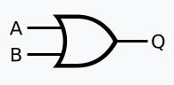
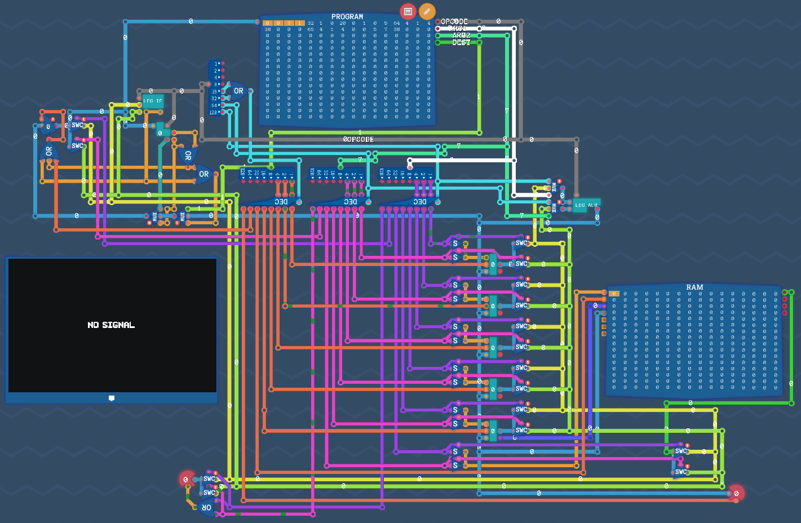

## Diodes

A diode allows current to only flow in one direction in a circuit.

### Schematic

```Plain
Anode (+) --|>|-- Cathode (-)
```

### Examples

```Plain
[Conventional Current (+) -> (-)]
(+)------|>|------(-)   Current can flow - The diode became a conductor.
(+)------|<|------(-)   Current can't flow - The diode became an insulator.
```

### Use Cases

- Protect a circuit (if a battery is connected incorrectly, for example)
- Convert AC to DC current  

> An LED, for example, is a Light-Emitting Diode.

### How a Diode Works

#### Conductors and Insulators

An atom is composed of the following elements:
- Nucleus (Protons and Neutrons)
- Orbital Shells (Holds electrons, which orbit around the nucleus)
- Conduction band  

The outermost shell is the valence shell. A conductor can have between 1 and 3 electrons in its valence shell.  

If an electron reaches the conduction band, it can break free and move to another atom.  

An insulator, however, has its conduction band far from the valence shell, making it difficult for an electron to escape. 

Silicon is an example of a semiconductor. Its conduction band is close to its valence shell, but silicon has 4 electrons in it, making it act as an insulator. However, given some external power, some electrons will gain enough energy to reach the conduction band and free themselves.


#### P-Type and N-Type Doping

Silicon (`Si`) atoms, when close together, share 4 electrons with their neighbors, thus, 'having' 8 electrons each, and becoming stable.

```Plain
Si Si Si Si Si Si Si Si Si Si Si
Si Si Si Si Si Si Si Si Si Si Si
Si Si Si Si Si Si Si Si Si Si Si
Si Si Si Si Si Si Si Si Si Si Si
Si Si Si Si Si Si Si Si Si Si Si
Si Si Si Si Si Si Si Si Si Si Si
```

##### N-Type

Some Phosphorus is added to the Silicon. `p` has one extra electron in its valence shell.  
These electrons are not needed, and so, they flow freely from atom to atom.  

```Plain
Si Si p Si Si Si Si Si Si Si p
p Si Si Si Si p Si Si Si Si Si
Si Si Si p Si Si Si Si p Si Si
Si p Si Si p Si Si Si Si Si Si
Si Si Si Si Si Si p Si Si p Si
Si p Si Si Si Si Si Si p Si Si
```

##### P-Type

Some Aluminum is added to the Silicon base. `Al` is missing one electron, so it can't provide its 4 neighbors with an electron to share.

```Plain
Si Si Al Si Si Si Si Si Si Si Al
Al Si Si Si Si Al Si Si Si Si Si
Si Si Si Al Si Si Si Si Al Si Si
Si Al Si Si Al Si Si Si Si Si Si
Si Si Si Si Si Si Al Si Si Al Si
Si Al Si Si Si Si Si Si Al Si Si
```

#### Combining both Types

When an `N-Type` is combined with a `P-Type`, some electrons from the `N-Type` side move over to the `P-Type` side, and replace the missing electrons there. This creates a barrier between both types: An electric field that prevents more electrons from switching sides.

##### Forward Bias

If energy is provided to the Cathode (`+`), electrons flow, as the voltage is superior to the barrier's.

```Plain
(-)-----[P|N]-----(+)
```

##### Reverse Bias

If energy is provided to the Anode (`-`), electrons can't flow, as the barrier expands, instead.

```Plain
(-)--[P]      [N]--(+)
```

## Transistor

Transistors are electronic components that behave as a `switch`, or `amplifier`.

### Schematic

```Plain
        .--.,-- Collector
Base --(--|<)
        `--`'-- Emitter
```

### Examples

#### Switch

If the `base` pin is provided with energy, the transistor allows current to flow in the main circuit.  


#### Amplifier

Altering the voltage given to the `base` pin allows us to control a larger voltage in the main circuit. 


### Types of Transistor

#### NPN

An NPN transistor combines the `base` pin and `collector` pin.


> Note: Even if the collector pin is disconnected from the circuit, a small amount of current still passes through. 

#### PNP

A PNP transistor receives energy through the `emitter` pin, and then divides it to the remaining pins.  


## Basic Logic

A logic gate is a device that performs one boolean operation: Two binary inputs produce a single binary output. These building blocks are the foundation of modern computing.  
Each gate has its own truth table, which defines every possible input and output variations.

### NAND

A NAND gate can be used to build all other basic gates. It always outputs, unless both inputs are active.


#### Truth Table

|A|**B**|**Output**|
|---|---|---|
|0|0|1|
|0|1|1|
|1|0|1|
|1|1|0|

#### Implementation

##### Electronics

Implementation using switches (transistors could be used instead) and a pull-up resistor:  


### NOT

Invert any given input.  


#### Truth Table

|**Input**|**Output**|
|---|---|
|0|1|
|1|0|

#### Implementation

##### Logic Gates


##### Electronics


### AND

Outputs `1` only when both inputs are `1`.


#### Truth Table

|A|**B**|**Output**|
|---|---|---|
|0|0|0|
|0|1|0|
|1|0|0|
|1|1|1|

#### Implementation

##### Logic Gates


##### Electronics

  


#### Bigger AND Gate

AND gates can be chained to accept more inputs.  


##### Truth Table

| A   | **B** | C   | **Output** |
| --- | ----- | --- | ---------- |
| 0   | 0     | 0   | 0          |
| 0   | 1     | 0   | 0          |
| 1   | 0     | 0   | 0          |
| 1   | 1     | 0   | 0          |
| 0   | 0     | 1   | 0          |
| 0   | 1     | 1   | 0          |
| 1   | 0     | 1   | 0          |
| 1   | 1     | 1   | 1          |

### OR

Outputs `1` if at least one input is `1`.  



#### Truth Table

|A|**B**|**Output**|
|---|---|---|
|0|0|0|
|0|1|1|
|1|0|1|
|1|1|1|

#### Implementation

##### Logic Gates


##### Electronics


#### Bigger OR Gate


##### Truth Table

| A   | **B** | C   | **Output** |
| --- | ----- | --- | ---------- |
| 0   | 0     | 0   | 0          |
| 0   | 1     | 0   | 1          |
| 1   | 0     | 0   | 1          |
| 1   | 1     | 0   | 1          |
| 0   | 0     | 1   | 1          |
| 0   | 1     | 1   | 1          |
| 1   | 0     | 1   | 1          |
| 1   | 1     | 1   | 1          |

### NOR

An OR gate followed by a NOT gate.  

A NOR gate is can also be used to build every other gate, just like NAND. However, NAND gates are preferred over NOR gates, as, in modern computers, they occupy less area and have less delay.


#### Truth Table

|A|**B**|**Output**|
|---|---|---|
|0|0|1|
|0|1|0|
|1|0|0|
|1|1|0|

#### Implementation

##### Logic Gates


### XOR

Either input is `1`, exclusively. (OR, but if both inputs are on, it turns off.)

  

#### Truth Table

| A   | **B** | **Output** |
| --- | ----- | ---------- |
| 0   | 0     | 0          |
| 0   | 1     | 1          |
| 1   | 0     | 1          |
| 1   | 1     | 0          |

#### Implementation

##### Logic Gates


### XNOR

Inverted `XOR`.  


#### Truth Table

|A|**B**|**Output**|
|---|---|---|
|0|0|1|
|0|1|0|
|1|0|0|
|1|1|1|

#### Implementation

##### Logic Gates

  

Although this circuits works, it can be further optimized to save `1` gate.  


> From this point on, circuits will become exponentially more complex. Optimizations like this one can be found almost everywhere, however, when the choice between efficiency and readability arises, I will choose to keep things simple. If you found a way to optimize any of my circuits, please let me know. I'd be happy to keep improving these notes, and credit you for your findings.

## Binary

Binary is a base-2 numeral system: A simple way to represent numbers using only two states. Each binary 'digit' is called a *bit*, and 8 bits together form a *byte*.  
To represent large binary values, it's common to use hexadecimal as well, to shorten them into a more readable format.

| Binary | Decimal | Hexadecimal |
| ------ | ------- | ----------- |
| 0000   | 00      | 0           |
| 0001   | 01      | 1           |
| 0010   | 02      | 2           |
| 0011   | 03      | 3           |
| 0100   | 04      | 4           |
| 0101   | 05      | 5           |
| 0110   | 06      | 6           |
| 0111   | 07      | 7           |
| 1000   | 08      | 8           |
| 1001   | 09      | 9           |
| 1010   | 10      | A           |
| 1011   | 11      | B           |
| 1100   | 12      | C           |
| 1101   | 13      | D           |
| 1110   | 14      | E           |
| 1111   | 15      | F           |


## Arithmetic Operations

### Addition

Adding two numbers can be done using a simple, manual algorithm: By adding the last *bit* of both numbers first, carry if necessary, then move to the next number, and so on.

| **+** | 0 | 1  |
| ------- | --- | ---- |
| 0     | 0 | 1  |
| 1     | 1 | 10 |


#### Half Adder

Add 2, single-digit binary numbers.

| **A** | **B** | **Carry** | **Sum** |
| ----- | ----- | --------- | ------- |
| 0     | 0     | 0         | 0       |
| 0     | 1     | 0         | 1       |
| 1     | 0     | 0         | 1       |
| 1     | 1     | 1         | 0       |


#### Full Adder (ADD)

When adding 2 binary numbers, one operation might return a carry value, which the `half adder` can't accept, as it only has 2 inputs.


To solve this issue, a `full adder` accepts 3 inputs.


#### 8-Bit Adder

To add two bytes, chain 8 full-adders.  
(The dark blue lines are equivalent to 8 bits in parallel, simplified for better readability. The blue rectangles split the wire into 8 bits, or vice versa.)


### Two's Complement

The most common solution to represent negative numbers is to interpret the last bit as a negative value. For a byte, the last bit changes its value from 128 to -128. 

> A negative number is often called a *signed* number.

The main advantage of the Two's Complement system is that the adder built previously also works with it.

#### Invert Sign

To switch between negative and positive numbers, flip all bits, then add 1.  


### Subtraction

Subtraction is as easy as negating (inverting the sign of) the second input.


### Multiplication

Multiplication is also similar to its decimal counterpart, but because binary is so small compared to decimal, the steps are also much simpler.

First, multiply the top number to every digit of the bottom one, and then add the results together.

| X   | 0   | 1   |
| --- | --- | --- |
| 0   | 0   | 0   |
| 1   | 0   | 1   |


#### 2-Bit By 2-Bit Multiplier


#### 4-Bit By 4-Bit Multiplier


### Division

Division is more complex. So much so, that it is often implemented in code, instead of hardware. For example, *ARM* CPUs don't have an instruction for division.  
Harder doesn't mean impossible of course, and if you are curious, there are many resources you can see. For example: [This Reddit post](https://www.reddit.com/r/TuringComplete/comments/1eqo00i/my_multiplier_and_divider_in_turing_complete/); [YouTube Video](https://www.youtube.com/watch?v=Wf_1mf6yCoc).

The steps for binary division are as follows:

1. Find the smallest part of the dividend greater than or equal to the **divisor**.

  
2. Write the first digit of **the answer**, and **copy the original divisor down**.

  
3. Subtract the **aligned dividend digits** by **the digits under the dividend**.

4. Lower **the next dividend digit**.  
   

5. Is **the total** greater or equal to the **divisor**? If so, add a `1` to the answer. If not, **add a `0` to the answer and return to step 4**.  
   


6. Return to step 2, until you reach the end of the number. If you reached the end, you found **the answer**.  
   

## Memory

### Byte Switch (SWC)

A bit switch, also known as a transistor, toggles a given input, using a second bit.


If 8 transistors are controlled by the same bit in parallel, a Byte Switch is created.

### Input Selector

Using byte switches, we can select which input to use.


### Bus

A Bus is useful to simplify wiring. One bit controls which input should be selected, and a second one, the output. This way, a single wire can transfer twice as much information.


### 1 Bit of Memory

There are [many ways](https://www.geeksforgeeks.org/latches-in-digital-logic/#sr-latch) to achieve a bit of memory.

#### Using Transistors and a Tick Delay

The oval component is a delay. This replaces the concept of a clock, however, in an electronic circuit, the save and load states are attached to a clock instead.


#### SR Latch

A Set-Reset Latch is the simplest one. The `S` input sets the output to `1`, and the `R` input, to `0`. If both inputs are on, the latch is in an undefined state, and outputs `0`.


#### D Latch

A Data Latch has two inputs: `D` (Data) and `E` (Enable). When the `E` input is high, the output `Q` follows the input `D`. When the `E` input is low, the output `Q` holds the last value of `D`.


### 8bit Register

After obtaining one bit of memory (the hexagon component), a byte of memory can be built.


### Binary Decoder

A decoder splits the two states of a bit into two separate outputs.


### 3bit Decoder


### Counter

A counter adds 1 every tick (clock cycle) to its output. If needed, it can also be overwritten to any given value.


### RAM

We could add more registers to store as much data as needed, however, these don't scale well, as storing a lot of data would require millions of wires. To solve this issue, we can organize latches in a matrix instead of a long, horizontal line.  

  
To access a specific latch, binary decoders can be used.  
  
This way, a single, short memory address can select any latch in the matrix.

#### Reading and Writing to the Matrix

We can modify the latch to reduce the amount of wires needed.  
  
This new latch uses the same wire for both input and output.  
  
This circuit would store the same value on every latch, which isn't useful. With some modifications, however, we can use the memory address to select which latch to modify.  
  


#### Storing Bytes Instead of Bits

  
In this example, we can provide 1 byte of information, a `write` or `read` signal, and a memory address. Since we are storing a full byte, the same memory address applies for all 8, single bit circuits.  
To make it easier to understand, we can abstract these concepts further:  

  
The larger the Address Bus is, the more bits can be managed. This is why a 32bit CPU can't manage more than 4 GB of RAM.  

  

This kind of RAM is Static RAM (**S**RAM), which uses many transistors, making it faster, but is more expensive to produce than **D**RAM.

## CPU Architecture

### ALU

An ALU (Arithmetic Logic Unit) performs bitwise operations (OR, AND, NOR, NAND) and basic math (ADD, SUB). You can also add any other arithmetic functionality to it, such as multiplication and division.

This circuit uses the following instructions:
- `0` OR
- `1` NAND
- `2` NOR
- `3` AND
- `4` ADD
- `5` SUB


This ALU can also be optimized to use fewer gates:


### Conditions

Conditions allow the CPU to compare values. In this case, values are compared against 0.

Instructions:
- `0` Never (Always output 0)
- `1` If value = 0
- `2` If value < 0
- `3` If value ≤ 0
- `4` Always (Always output 1)
- `5` If value ≠ 0
- `6` If value ≥ 0
- `7` If value > 0


### Instruction Decoder

A binary decoder, adapted to use the last 2 bits of a byte.

Instructions:
- `0` Immediate
- `64` Calculation
- `128` Copy 
- `192` Condition


## Putting it All Together

We can now use the previous components to build and OVERTURE architecture computer!

### Upgraded Register

Adding an output pin to always output the register's value will prove to be useful in the future.


### Registers

This circuit copies information between registers. To do this, it uses the lowest 3 bits of a byte as the destination, and the next 3 bits as the source. 


### Program

The RAM we built previously can be used as a program. To move the memory address forward, simply attach it to our clock. You may notice that many pins are missing on the RAM component: This it to simplify the schematic, as this RAM is read-only and pre-programmed. Despite it having 4 outputs, this computer will only use the first one.

Every tick of the clock, the next instruction is passed to the registers, allowing the copy of values to be scripted.


### Math

Copying values between registers isn't very useful by itself. 

Our ALU can perform basic bitwise operations, given an instruction. To implement it, a few modifications had to be made:
1. The Instruction Decoder was added, as well as the ALU;
2. Register decoders should be disabled when not performing a copy operation;
3. The ALU was wired to the OPCODE (instruction) byte as well, since, in this context, the first 3 bits represent which arithmetic operation to execute;
4. Finally the ALU was wired to register 3 (4th), to store the result of the operation, as well as to the register 1 and 2, to act as inputs.  

  

So far, our computer can copy information and perform calculations on that data.  
For example, to add 2 numbers from input, and then output the result:

```
177 # Input -> REG1
178 # Input -> REG2
68  # ADD REG1 and REG2
158 # REG3 -> Output
```

### Immediate Values

Sometimes it's useful to insert values directly from code (hard-code values).  
If the two highest bits are both off, the value provided in the lowest 6 bits is stored in the register 0.


### Conditions

Finally, we can add conditions to the computer.  
Our condition component can only compare a value against 0, but together with subtraction and addition, it allows for any comparison to be executed.

Any instruction given to the condition circuit will use `REG3` as input, and the output overrides the counter's value. This allows for jumping to any line in the program, and thus, create loops. 


Adding conditions was the last step to build a simple, but fully capable computer! Although slow, this computer can execute any 256 bytes program. 

> Keep in mind that loops are still very limited, and because immediate values only supports saving 6 bits, you can't jump past the 63rd instruction.

## Assembly

Now that the computer is finished, we can start programming it. 

Remembering the value for each instruction can be difficult, and so, it's useful to assign a name to each. This layer of abstraction is called *assembly*.

Before a program written in assembly can be executed, it must be compiled; Transcoded back into bytes.

### Instructions

#### Immediate

| Command | Instruction | Description                           |
| ------- | ----------- | ------------------------------------- |
| `0-63`  | 0-63        | Insert a hard-coded value into `REG0` |

#### Calculation

| Command | Instruction | Description                              |
| ------- | ----------- | ---------------------------------------- |
| `OR`    | 0           | Bitwise OR `REG1` and `REG2` to `REG3`   |
| `NAND`  | 1           | Bitwise NAND `REG1` and `REG2` to `REG3` |
| `NOR`   | 2           | Bitwise NOR `REG1` and `REG2` to `REG3`  |
| `AND`   | 3           | Bitwise AND `REG1` and `REG2` to `REG3`  |
| `ADD`   | 4           | Add `REG1` and `REG2` to `REG3`          |
| `SUB`   | 5           | Subtract `REG1` and `REG2` to `REG3`     |

#### Copy

| Command          | Instruction   | Description                       |
| ---------------- | ------------- | --------------------------------- |
| `r0r1` - `r0out` | 129-134       | Copy `REG0` to `REG1-5`/`output`  |
| `r1r0` - `r1out` | 136-142       | Copy `REG1` to `REG0-5`/`output`  |
| `r2r0` - `r2out` | 144-150       | Copy `REG2` to `REG0-5`/`output`  |
| `r3r0` - `r3out` | 152-158       | Copy `REG3` to `REG0-5`/`output`  |
| `r4r0` - `r4out` | 160-166       | Copy `REG4` to `REG0-5`/`output`  |
| `r5r0` - `r5out` | 168-172 & 174 | Copy `REG5` to `REG0-4`/`output`  |
| `inr0` - `inout` | 176-182       | Copy `input` to `REG0-5`/`output` |

#### Condition

| Command  | Instruction | Description        |
| -------- | ----------- | ------------------ |
| `never`  | 192         | Never jumps        |
| `is0`    | 193         | Jump if `REG3` = 0 |
| `less0`  | 194         | Jump if `REG3` < 0 |
| `leq0`   | 195         | Jump if `REG3` ≤ 0 |
| `always` | 196         | Always jumps       |
| `not0`   | 197         | Jump if `REG3` ≠ 0 |
| `meq0`   | 198         | Jump if `REG3` ≥ 0 |
| `more0`  | 199         | Jump if `REG3` > 0 |

## Representing Data

You might be wondering how computers can display text, images, and play sound. 

Just like how, for negative numbers, the value stored is the same, and only its *context* changes, the same logic applies to represent anything else.

For example, to represent text, it's very common to use either ASCII or UNICODE.

The table below is only part of the ASCII standard, used for capitalized letters:

| Dec | Hex | Binary   | HTML     | Char |
| --- | --- | -------- | -------- | ---- |
| 65  | 41  | 01000001 | `&#65;`  | A    |
| 66  | 42  | 01000010 | `&#66;`  | B    |
| 67  | 43  | 01000011 | `&#67;`  | C    |
| 68  | 44  | 01000100 | `&#68;`  | D    |
| 69  | 45  | 01000101 | `&#69;`  | E    |
| 70  | 46  | 01000110 | `&#70;`  | F    |
| 71  | 47  | 01000111 | `&#71;`  | G    |
| 72  | 48  | 01001000 | `&#72;`  | H    |
| 73  | 49  | 01001001 | `&#73;`  | I    |
| 74  | 4A  | 01001010 | `&#74;`  | J    |
| 75  | 4B  | 01001011 | `&#75;`  | K    |
| 76  | 4C  | 01001100 | `&#76;`  | L    |
| 77  | 4D  | 01001101 | `&#77;`  | M    |
| 78  | 4E  | 01001110 | `&#78;`  | N    |
| 79  | 4F  | 01001111 | `&#79;`  | O    |
| 80  | 50  | 01010000 | `&#80;`  | P    |
| 81  | 51  | 01010001 | `&#81;`  | Q    |
| 82  | 52  | 01010010 | `&#82;`  | R    |
| 83  | 53  | 01010011 | `&#83;`  | S    |
| 84  | 54  | 01010100 | `&#84;`  | T    |
| 85  | 55  | 01010101 | `&#85;`  | U    |
| 86  | 56  | 01010110 | `&#86;`  | V    |
| 87  | 57  | 01010111 | `&#87;`  | W    |
| 88  | 58  | 01011000 | `&#88;`  | X    |
| 89  | 59  | 01011001 | `&#89;`  | Y    |
| 90  | 5A  | 01011010 | `&#90;`  | Z    |  

You may have used RGB values before. These are used to represent a color:

```
RGB(0-255; 0-255; 0-255)
```

As the name suggests, the first value represents Red, the second, Green, and the last, Blue.

To create images, simply chain RGB values in a grid; Videos are nothing more than many images chained together.

## LEG

The LEG computer is similar to OVERTURE, but instead of a single byte per instructions, LEG uses 4. This makes it much easier to program, and allows for immediate values and jumps up to `256`.

Even though OVERTURE is fully functional, there are still many useful concepts we skipped over, such as functions, writable RAM, and comparisons between two numbers.

### The Main Board

Instead of a single output, this program component outputs the selected byte, as well as the 3 following ones. To support 4 byte instructions, the clock increments by 4 instead of 1 each tick.

Each 'chip' built previously had to be re-built, but without the limitations OVERTURE had, they were also much improved.

Connecting RAM is as easy as wiring it to replace the last register. This means that now the computer only has 5 usable registers instead of 6, but the RAM provides 256 more, although slower.  
`REG4` stores the memory address for the RAM, however, outside of memory operations, it can still be used as a regular register.



### ALU

Aside from the previous, simple operations, the LEG ALU can also `XOR` and `MUL` (multiply) values. Division, exponentiation, and other operations could be added, although those can be performed through code as well.

Instructions:
- `0` ADD
- `1` SUB
- `2` AND
- `3` OR
- `4` NOT
- `5` XOR
- `6` MUL(TIPLY)


#### Multiplication

The following circuit is a 4 bit by 4 bit multiplier. It can then be scaled to use 4 bytes instead of bits.


### Conditional (IF)

The new conditional chip takes two numbers, and then uses two new components: `Equal` and `Unsigned Less` as a base to compare values. From them alone, all other instructions can be achieved.

Instructions:
- `32` Equal
- `33` Not equal
- `34` Less than
- `35` Less or equal to
- `36` Greater than
- `37` Greater or equal to
- `38` Always true


#### Equal

Calculating equality can be done by subtracting both inputs, then verifying that the result is 0.


#### Less (unsigned)

To verify if the first input is less than the second, invert the first input, then add it with the second. Notice how the output is connected to `ADD`'s `CARRY` pin, instead of the result. The goal is to check if `ADD` overflows.

> Note: `NEG` and `NOT` are different components. `NEG` converts its input to a negative value, while `NOT` inverts the input. For example, if the input is 6, `NEG` outputs 250 (-6), while `NOT` outputs 249 (-7).


### Functions (FN)

Although the previous computer was already Turing complete, functions are not only much easier to use than simple jumps, but they allow for function calls to be chained, and to call another function from within a function.

When a function is called, its value needs to be stored, and then the computer will either encounter a return statement and `POP` the function's address away, or `PUSH` a new value on top. This is the exact behavior of a stack.

The stack could be implemented in two (or even more) ways:
- Having a separate RAM component just for the stack;
- Using the system RAM, and starting from the last byte, up.

The latter option is how most modern computers work. The memory allocated to a program is split, eliminating the need for a physical stack. On our LEG computer, though, we only have 256 bytes of RAM, so I decided to implement a physical stack.


#### The Stack

You may notice how the stack is being populated from the last byte instead of the first. This is to make the `STACK` reusable, if system RAM was to be used instead.


### Assembly

The assembly for LEG might even be simpler than OVERTURE's. There are a few things to keep in mind, though:
- `REG4` was renamed to `ADDR`, as it is more commonly used as the memory address, opposed to a regular register.
- There is no `COPY` statement. Instead, `ADD` a value with 0 to select a destination to copy to. Keep in mind that 0 is `REG0` in this context, so it must be kept empty while copying values.
- If a value in a command is 0, it must be typed with an actual 0 in that place. This is because the clock is fixed, and if an instruction only uses 2 or 3 bytes instead of 4, the unused bytes must be set to 0, to not misalign the next clock cycle. A solution to this problem would be to implement a variable counter, capable of skipping unused bytes. This would complicate the physical circuit quite a bit, and so I decided against implementing it.

#### Assembly Codes

- 32 - 39 `IF`
- 0 - 6 `MATH`
- 64 - 70 `IMMEDIATE`
- 16 - 17 `STACK/FUNCTIONS`

#### Manual

All instructions are 4 bytes long.  
`OPCODE ARG1 ARG2 DEST`


**COPY** - Copy data between `IO`, `REG0-3`, and `ADDR/RAM`.

```asm
ADD <from> 0 <to>

ADD REG0 0 REG1 # Example
```

**MATH** - Perform arithmetic operations.
- `ADD`
- `SUB`
- `AND`
- `OR`
- `NOT`
- `XOR`
- `MUL` (multiplication)

```asm
ADD <ARG1> <ARG2> <destination>

SUB REG2 REG1 IO # Example
```

**IMMEDIATE** - Insert data directly from the program.  
Every arithmetic operation has an `i` variant.

```asm
ADDi <ARG1> <number> <destination>

ADDi REG0 10 REG2 # Example
```

**LOGIC** - Conditionals  
If a condition is met, jump to `n` line.
- `EQ` Equal
- `NEQ` Not equal
- `LES` Less than
- `LEQ` Less or equal to
- `MOR` Greater than
- `MOQ` Greater or equal to
- `JMP` Always true; Jump no matter the inputs' values

```asm
EQ <ARG1> <ARG2> <jump>

MOQ REG1 REG2 12 # Example
JMP 0 0 12       # Example - Jumping with no condition
```

**MEMORY** - Store data  
The RAM module can hold 256 bytes.  
To use RAM:
1. Select a memory address (0-256), and copy it to `ADDR`.
2. Read or Write to `RAM`.

> The `ADDR` register can be used as a regular register outside of memory operations.  

Example:

```asm
ADDi 0 10 ADDR # Address 10
ADD IO 0 RAM   # Write Input to RAM
ADD RAM 0 REG0 # Address 10 is still selected; output its contents to REG0
```

**FUNCTIONS** - Reuse code  
Create a function:

```asm
label functionName
  ...
RET
```

> Label resolves to the next instruction.

Replace `...` with the function contents.  
To call the function:

```asm
CALL 0 0 functionName
```

## Sources and Contributors

Every circuit in this post was designed by me, mostly through trial and error, so the source would quite literally be: I made it up. `¯\_(ツ)_/¯`

Most screenshots were taken from Turing Complete, a simulator/game on Steam. As the name suggests, the simulator attempts to teach you the basics of computing, and give you a platform to test and develop on. If you've read this far, I highly recommend you to try it!

If you find that I made a mistake, want to improve one of my circuits, or have any constructive feedback to share, please contact me, and I will happily add your name to the credits.

Everything in this website, including other notes and posts (and the website itself) are open-source, licensed under the `MIT`. Feel free to use it for your own research. If you'd like to submit a PR or Issue on [GitHub](https://github.com/TrudeEH/web), I would appreciate it!
