## Remembering Data

An `OR` gate could be used to store a single bit.  
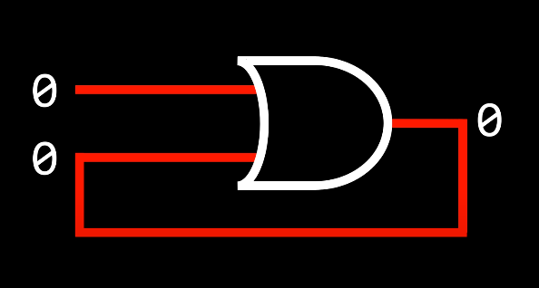  
If the input `A` is changed to `1`, the `OR` gate will output `1`, and then receive it.  
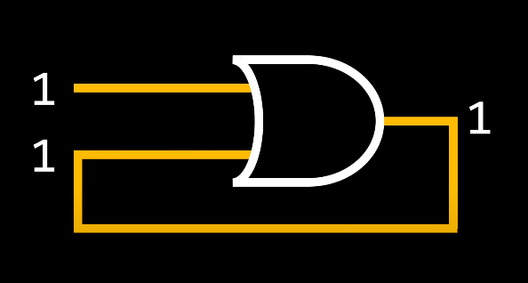  
Even after the input `A` is set to `0`, the output does not change. The `OR` gate "remembers" that, at one point in the past, the `A` input was set to `1`.  
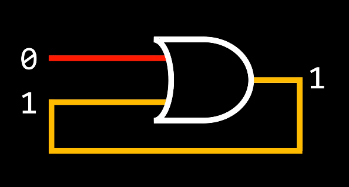  
The inverse can be done with an `AND` gate.  
  
To remember either a `1` or a `0`, we can do the following:  
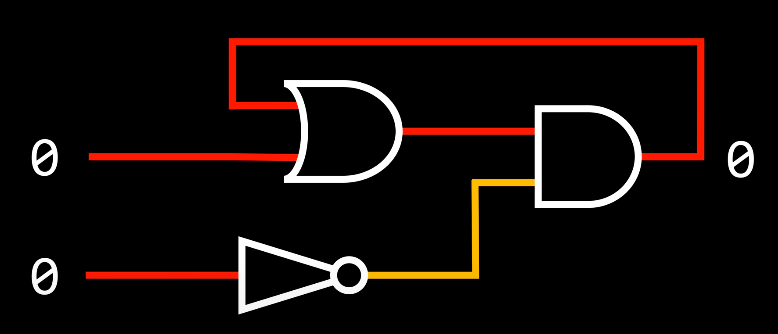  

### AND-OR LATCH

The input `A` sets the output to `1`, and the input `B` sets the output to `0`. This circuit is able to store a bit of information, while powered on, even after both inputs are set to `0`.  
A slightly more advanced and intuitive version can be built as follows:  
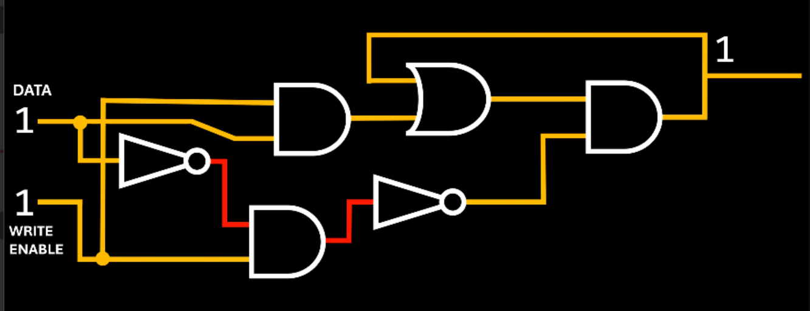  

### GATED LATCH

The input `A` is the value to store, and when `B` is set to `1`, the value is stored.  
This is not the only way to store data using logic gates, but it is one of the simplest.

## Registers

A single bit isn't very useful, so we can use the previous circuit to create an 8bit register.  
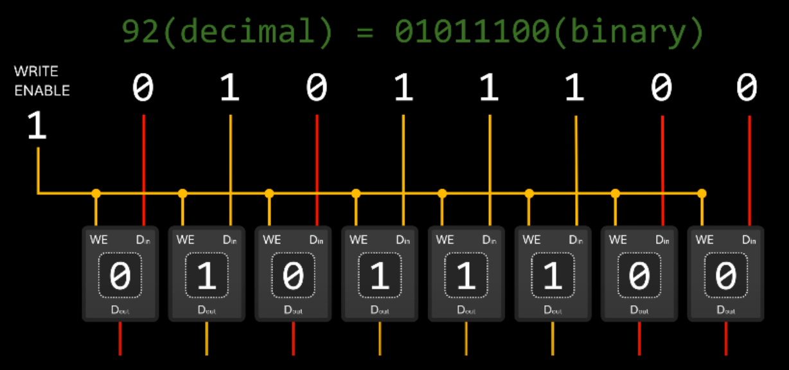

## Binary Decoder

Select which circuit to activate, depending on the task at hand.  
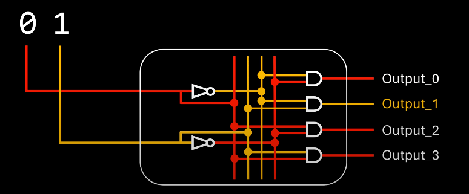

## RAM

Registers don't scale well, however, as storing a large amount of data would require millions of wires.  
We can organize latches in a matrix instead of a long, horizontal line.  
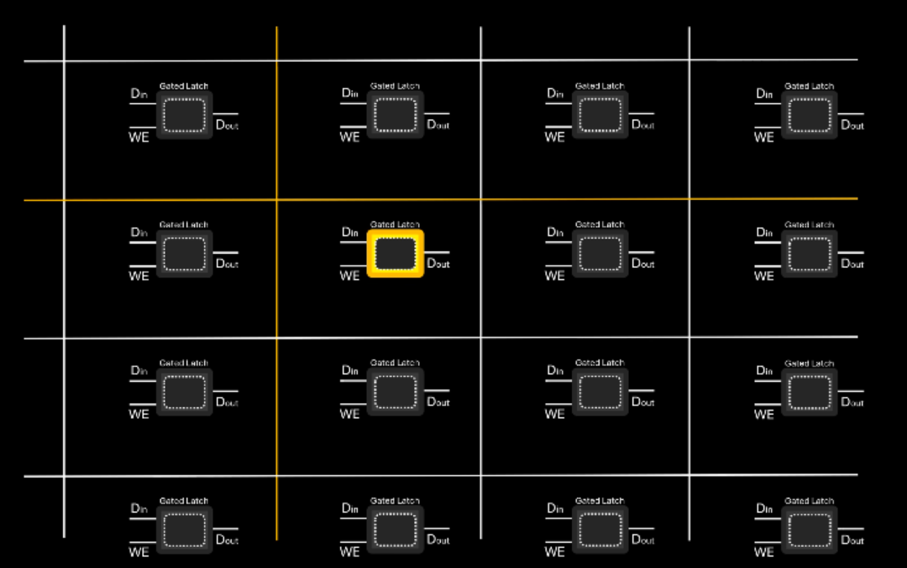  
To access a specific latch, binary decoders can be used.  
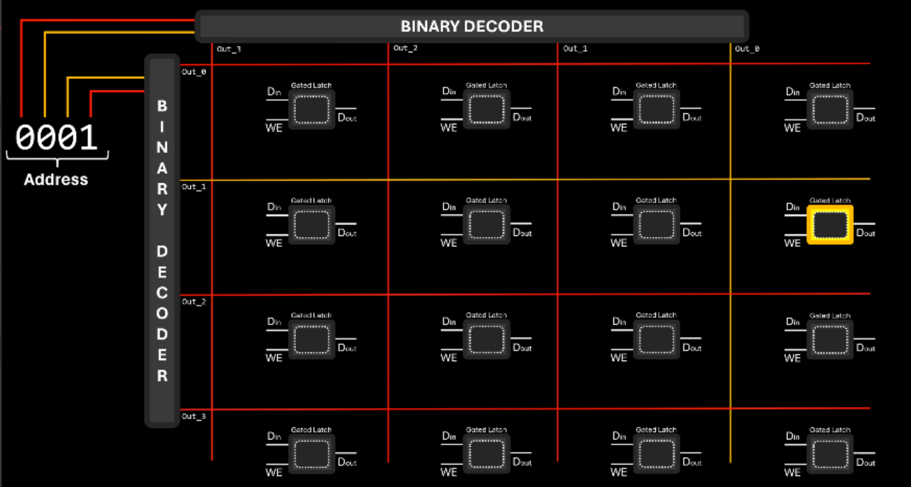  
This way, a single, short memory address can select any latch in the matrix.

### Reading and Writing to the Matrix

We can modify the latch to reduce the amount of wires needed.  
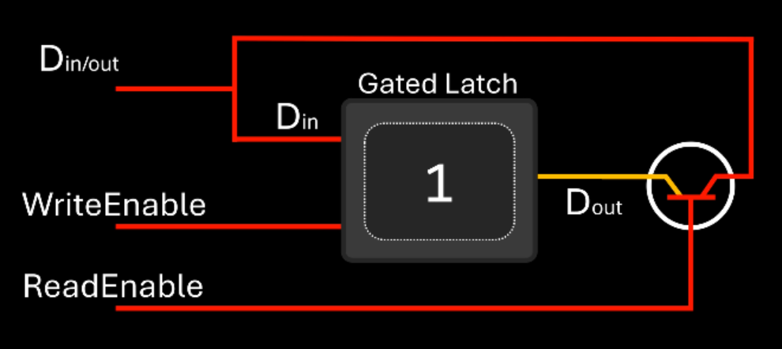  
This new latch uses the same wire for both input and output.  
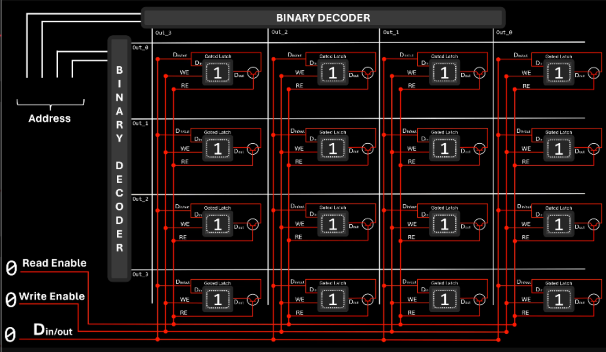  
This circuit would store the same value on every latch, which isn't useful. With some modifications, however, we can use the memory address to select which latch to modify.  
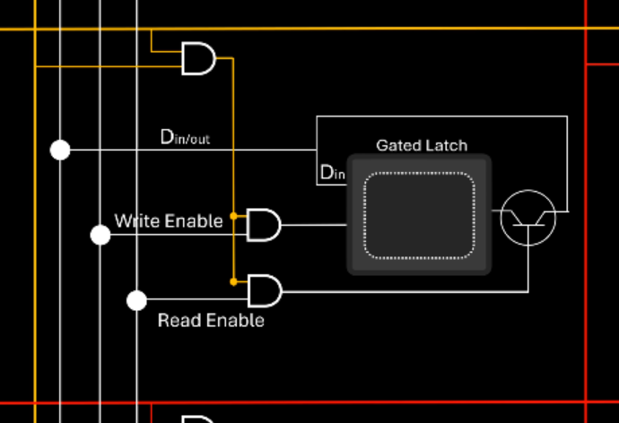  
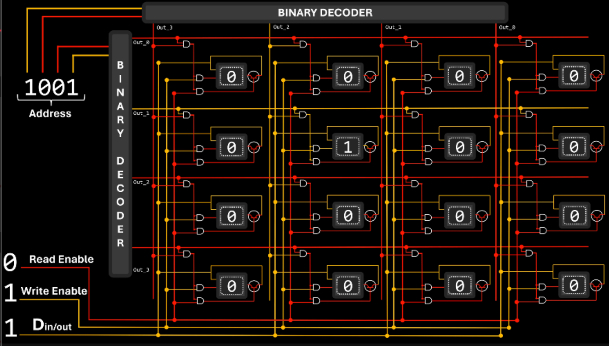

### Storing Bytes Instead of Bits

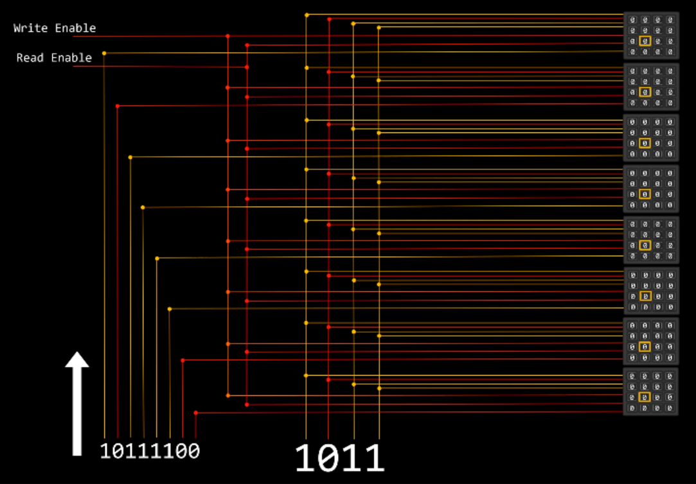  
In this example, we can provide 1 byte of information, a `write` or `read` signal, and a memory address. Since we are storing a full byte, the same memory address applies for all 8, single bit circuits.  
This configuration is more commonly known as **RAM**.  
To make it easier to understand, we can abstract these concepts further.  
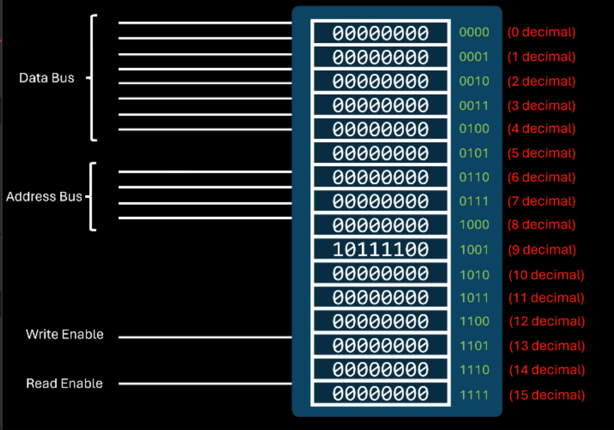  
The largest the Address Bus is, the more bits can be managed. This is why a 32bit CPU can't manage more than 4 GB of RAM.  
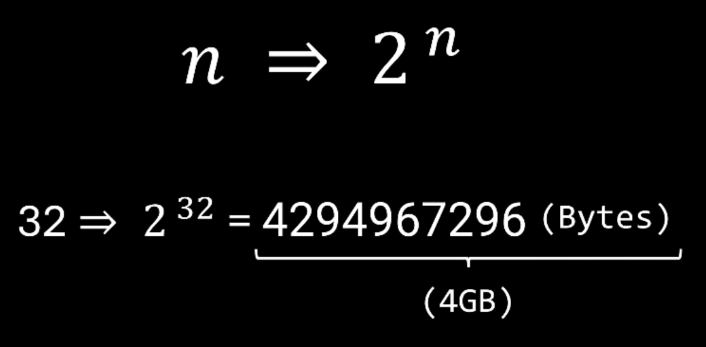  
This kind of RAM is Static RAM (**S**RAM), which uses many transistors, making it faster, but more expensive to produce than **D**RAM.
