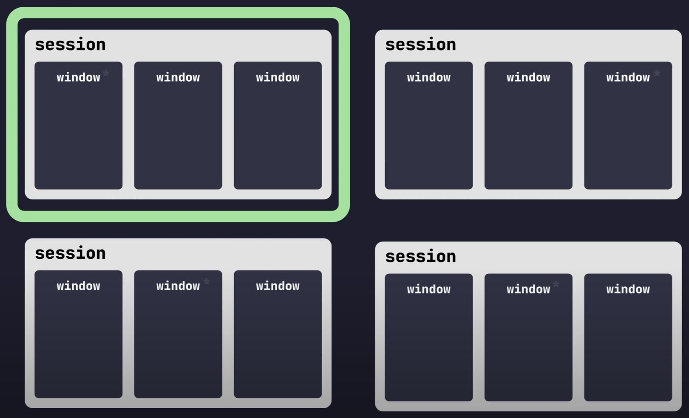

## Overview

`tmux` is a multiplexer that, among other things, is able to:
- Preserve a terminal session if it is closed or lost.
- Access an old session from a new terminal window.
- Connect to a remote session and save its state once disconnected.
- Split the terminal into multiple tabs and panes.

### Components

- **Sessions** (Only one `tmux` session can be used at a time. Similar to workspaces.)
- **Windows** (A session contains windows. These behave like tabs in other programs.)
- **Panes** (A split in the window, each with its own terminal instance.)  



## [Commands](https://tmuxcheatsheet.com/)

To start a command, press the `PREFIX KEY <p>`. The default is `ctrl b`, but my configuration uses `ctrl s` instead.  

|Command|Description|
|---|---|
|`<p> c`|Create a new window.|
|`<p> [0-9]`|Switch to [0-9] window.|
|`<p> n`|Switch to the next window.|
|`<p> p`|Switch to the previous window.|
|`<p> &`|Close a window.|
|`<p> %`|Split the pane horizontally.|
|`<p> "`|Split the pane vertically.|
|`<p> [ARROW KEYS]`|Switch active pane.|
|`<p> [{,}]`|Move the selected pane.|
|`<p> q`|Toggle pane numbers. Then press a number to select that pane as the active one.|
|`<p> z`|Expand the selected pane to take up the whole window.|
|`<p> !`|Turn the selected pane into a window.|
|`<p> x`|Close a pane.|
|`tmux`|Create and attach to a new session.|
|`tmux new -s <name>`|Create a new session with a name.|
|`tmux ls`|List active sessions.|
|`<p> s`|List active sessions from tmux.|
|`<p> w`|Preview windows for each session.|
|`tmux attach`|Attach to last session.|
|`tmux attach -t <name>`|Attach to the session <name>.|
|`<p> :`|Command mode.|

> With `mouse-mode` enabled, you can use the cursor to navigate through `tmux`. To select text (to copy, for example), use `shift [drag]`.

## Configuration

Configure `tmux` using the `$HOME/.tmux.conf` config file.  
For example:

```Shell
# easy reload config
bind-key r source-file ~/.tmux.conf \; display-message "~/.tmux.conf reloaded."
# set window split
bind-key v split-window -h
bind-key b split-window
# default window title colors
set-window-option -g window-status-style fg=colour244,bg=default,dim
# active window title colors
set-window-option -g window-status-current-style fg=orange,bg=default,bright
# pane border
set-option -g pane-border-style fg=colour236
set-option -g pane-active-border-style fg=orange # orange
# message text
set-option -g message-style bg=colour235,fg=orange
# pane number display
set-option -g display-panes-active-colour blue
set-option -g display-panes-colour orange
# clock
set-window-option -g clock-mode-colour orange
# Leader Key
set -g prefix C-a
bind-key C-a last-window
# Start index at 1
set -g base-index 1
# Allows for faster key repetition
set -s escape-time 50
# Rather than constraining window size to the maximum size of any client
# connected to the *session*, constrain window size to the maximum size of any
# client connected to *that window*. Much more reasonable.
setw -g aggressive-resize on
# Allows us to use C-a a <command> to send commands to a TMUX session inside
# another TMUX session
bind-key a send-prefix
# Status Bar
set-option -g status-position top
set-option -g status-style "bg=default,fg=white"
set-option -g status-left "#[dim]S\#S W#{window_index}#[default]"
set-option -g status-right '%d#[dim]/#[default]%m#[dim]/#[default]%Y %I:%M#[dim]%P#[default]' # #[fg=white] to switch colors
set -g status-interval 1
set -g status-justify centre # center align window list
set -g status-left-length 14
set -g status-right-length 100
# hjkl pane traversal
bind h select-pane -L
bind j select-pane -D
bind k select-pane -U
bind l select-pane -R
bind-key C command-prompt -p "Name of new window: " "new-window -n '%%'"
# auto window rename
set-window-option -g automatic-rename
# Vi copypaste mode
set-window-option -g mode-keys vi
bind g copy-mode
bind -T copy-mode-vi v send -X begin-selection
bind-key -T copy-mode-vi y send -X copy-selection-and-cancel
bind P paste-buffer
# highlight color
set -g mode-style "fg=black,bg=orange"
# Mouse support
set -g mouse on
# VIM Options
set-option -g focus-events on
set-option -sa terminal-features ',foot:RGB'
```
