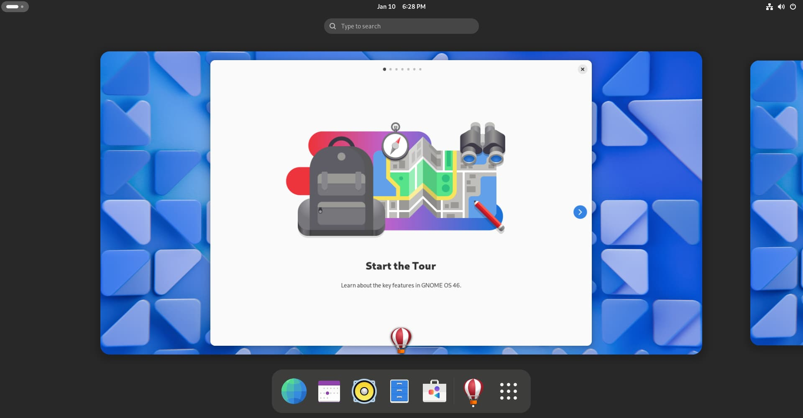
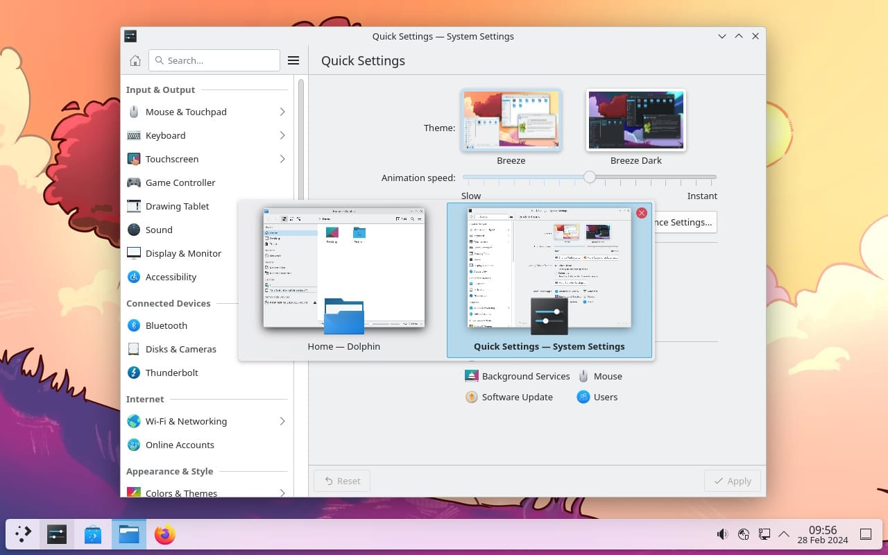

## What is Linux?

You can think of Linux as an alternative to Windows and macOS; An operating system for your computer.

An OS is responsible for managing the computer's physical components (hardware) and programs (software). It acts as a 'bridge' between the two, allowing them to work together. Most computers come with Windows pre-installed, and Apple Macs come with macOS, so why should one consider switching to Linux instead?

Linux is open-source, meaning that anyone can read, distribute and contribute to the project however they see fit. Linux is also free of charge, and you don't need a license to use it.

Linux desktops tend to be less resource-intensive than Windows and macOS, meaning they perform well on older or low-powered machines. If you use an Android device, Chromebook, or even smart home devices, you are already using Linux.

There is no company behind Linux, due to its open nature, so you will always be private while using Linux by itself; It doesn't collect any user data, doesn't have paid features, and doesn't make you see any ADS. Linux also doesn't force you to install updates if you don't want to, and won't interrupt your work for any reason.

The disadvantage of Linux (which has been improving a lot over the last few years) is software support. Some apps, such as Photoshop and Microsoft Word, don't yet support Linux. Before switching, make sure all your programs are supported, and if not, try to find other free and open alternatives, such as Kritta and GIMP instead of Photoshop, or Google Docs, LibreOffice or OnlyOffice to replace Microsoft Word.

## Choose a Base Distribution

One of the best features of Linux is that you can customize it and use it however you like. Instead of a global Linux OS, you get to choose a distribution. Linux itself is just a Kernel - like an engine, that can be used to power any distribution.

A Linux distro bundles the Linux Kernel, a Desktop Environment and some free and open-source programs to help you get started.

There are hundreds of distros, but only three will be more relevant to you:

- Debian Linux
- Arch Linux
- Fedora Workstation

These are often used as a base for other distros to build upon.

Debian is a community distribution with a focus on stability: Programs shipped by Debian are usually very old, but tend to have very few issues.

Arch Linux is an advanced distribution that focuses on shipping programs as soon as they are available. You'd have to build your own system if you decide to use Arch, but it also gives you the most control.

Finally, Fedora strikes a balance between the two. It is backed by Red Hat, uses recent, but tested programs, and comes with a desktop ready for you to use.

## Choose Your Desktop Environment

Again, there are many DEs, but the two most popular are *GNOME* and *KDE Plasma*.

This choice won't affect how your computer works 'under the hood', but rather how it looks like and how it 'feels' to use. 

GNOME is simple and intuitive, and although it isn't as trivial to customize, it is also stable and predictable. You can add more features on top of it with extensions, and it has the best application ecosystem available. By default, GNOME feels more like macOS, and is my desktop of choice.

KDE Plasma is almost the exact opposite. It is very flexible, and you can easily customize it however you see fit. You can change almost everything through the settings, but that also makes it more complex to use. By default, it looks a lot like Windows. The main downsides are that KDE tends to be more buggy, and applications designed for it are more complex and often lack simpler features.

If you can, try both desktops, and see which one you like the most. As a general rule, if you came from Windows, try KDE Plasma first, and if you came from macOS, go with GNOME.

If you chose GNOME, I recommend you to install [**Fedora Workstation**](https://fedoraproject.org/workstation/).  
If you decided to go with Plasma, select between [**Fedora Plasma Spin**](https://fedoraproject.org/spins/kde) and [**Kubuntu**](https://kubuntu.org/getkubuntu/).  
Although [**Linux Mint**](https://linuxmint.com/download.php) doesn't use either desktop mentioned above, it's still a great distribution to get started with, especially for Windows users, so I had to mention it.

## Install Linux

First, you'll need a spare USB drive. The drive will be erased, so make sure to not leave anything important on it. Download your preferred distribution from their respective websites (likely an `.iso` file) and a flash tool, such as [Balena Etcher](https://etcher.balena.io/).

Then, use Etcher to flash the `iso` onto the USB drive. This is a simple process: Select the `iso` file, then, the USB drive, and hit `Flash`.

After doing so, you can reboot your computer. The USB drive you created contains the Linux system that you want to install, but to use it, you first have to tell the computer to start (boot) from it instead of your current Windows or macOS installation. On most Windows devices, you can press F10,F11 and F12 repeatedly while starting, and a menu will appear, where you can select your USB drive. If this didn't work for you, try the DEL and F2 keys, and you will enter the BIOS. From there, look for a list of boot devices, and place the USB drive on top of the list. If you couldn't do this, or are using a Mac, search for help online: This step is often different, depending on the computer you are using.

Once you see the logo of your distro, follow the steps on-screen to install it. The exact process will change over time, so by the time you read this post, anything I write could be outdated. Luckily, it's easy to follow, so you won't need a guide for this.

> At this point, your computer is already running Linux *using the USB drive*. To actually install it, you will need to ***WIPE*** your computer's drive. This action will ***DELETE EVERYTHING*** on your computer, so be sure to back up anything you don't want to lose.

If prompted, select your preferred desktop, and when the installer asks for a disk, select your computer's drive, and fully erase it. If you encounter any option that confuses you, leave it as the default, or quickly search what it does online. The default values are the ones most people would want to use, so they should be what you are looking for.

After a reboot, you should be greeted by a display manager (login screen), and after you log in, your new Linux desktop.

### Troubleshooting

If something went wrong, not all is lost.

Some of the most common issues are:
- **The computer is working, but one or more features seem broken.** Bluetooth or Wi-Fi don't work, or a touchscreen is unresponsive. In these cases, make sure that your hardware is supported, and try to install their proprietary drivers if available.
- **Low performance in games / display issues.** You are likely using an NVIDIA GPU. Install the proprietary drivers, and the issue should be resolved. Fedora comes with those drivers pre-installed, so try to update them using the "Software" app, and Mint comes with a program called "Driver Manager", where you can install the recommended driver for your GPU.
- **I can see my desktop, but text and icons look very small.** Go to settings and search for display scaling, then increase the slider until your desktop looks fine. This happens because you are using a high resolution screen, which has a greater pixel density than a regular screen. After applying your new scaling setting, reboot your machine.

## Install New Programs

Some programs might be missing, or you may need something that doesn't come installed by default.

To install new software, open the "Software" app on GNOME, or "Discover" on Plasma. From there, simply search for any software that you want, and then install it.

If you can't find what you are looking for, search online for the program's webpage and follow the instructions there.

## Keep Exploring!

With a Linux desktop and your programs installed, you should be ready to use your device. If you can, spend some time exploring and changing settings to customize your system, and make the most out of it.

If you had any issues that are beyond the scope of this post, and can't find a solution online, feel free to either contact me (links in the home page), or ask on Reddit / a Linux forum.
